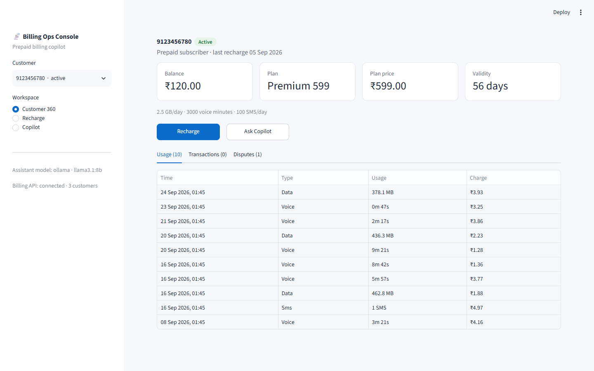
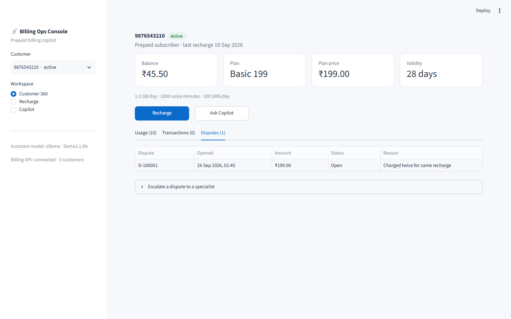
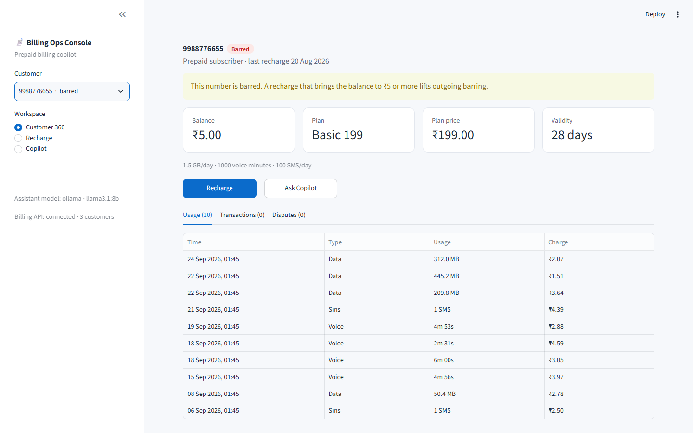
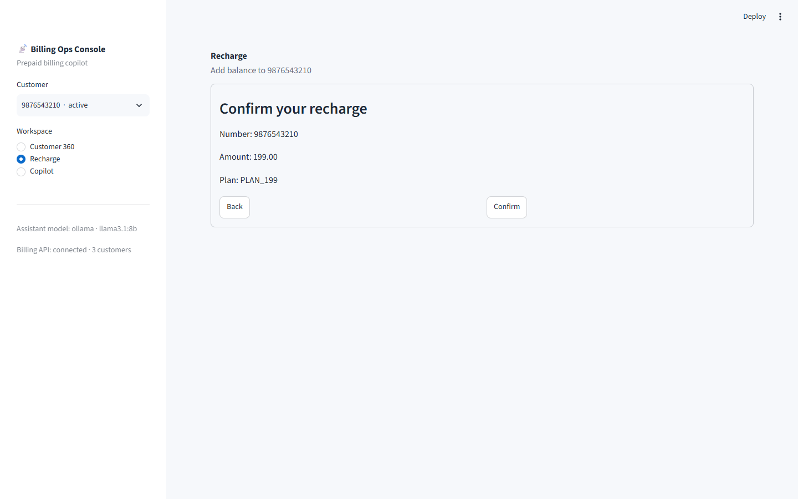
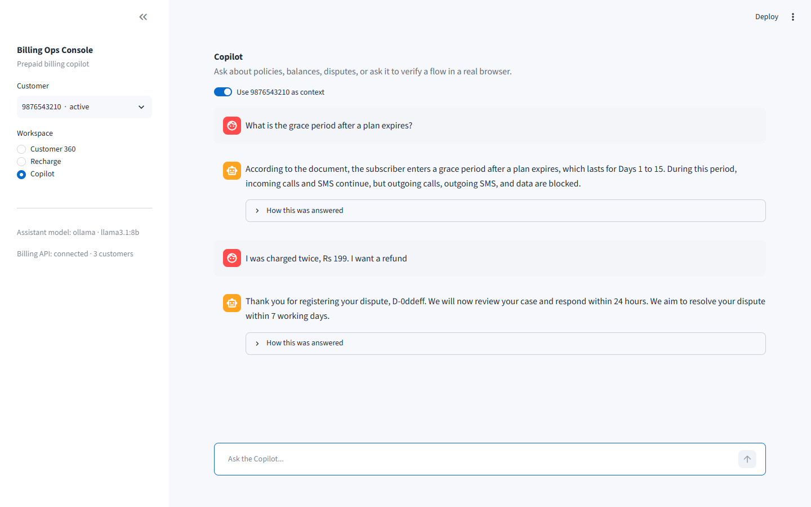
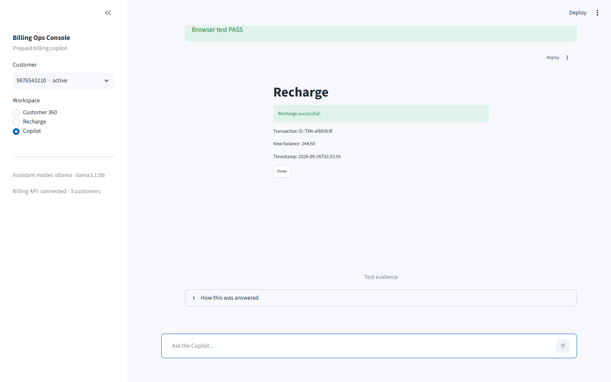
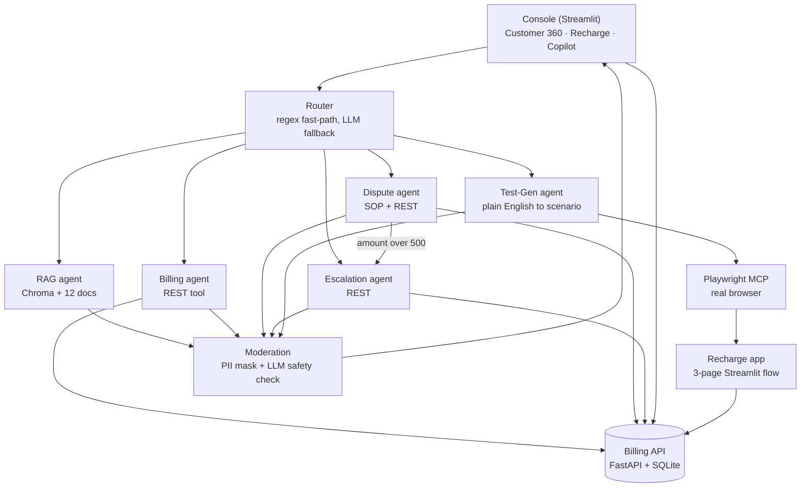

# Prepaid Billing Ops Copilot

A CRM-style console for prepaid-telecom billing support, with a multi-agent copilot behind it. An agent opens a
customer, sees their balance, usage, transactions and disputes, and asks the copilot to explain a policy, look up a
balance, raise or escalate a dispute, or **verify the recharge flow in a real browser**.

Built to show: RAG, LangChain, LangGraph, Langflow, DeepEval, a moderation layer, and autonomous UI testing with the
Playwright MCP server, on a domain (rating, CDRs, recharges, disputes) I know well.


*The walkthrough is a slideshow of the real screenshots below (captured with the same Playwright MCP client the QA
agent uses), not a screen recording.*



| Disputes and escalation | Barred customer | Recharge flow |
|---|---|---|
|  |  |  |

| Copilot: policy answer, then a dispute | Copilot: a browser test, with its evidence screenshot inline |
|---|---|
|  |  |

## What it does

| Route | Agent | Example |
|---|---|---|
| RAG | Answers only from 12 policy documents (Chroma), or says it does not know | "What is the grace period after a plan expires?" |
| Balance | Reads the billing API, phrases the reply | "What's the balance?" |
| Dispute | Registers a dispute, states the SLA; escalates on the SOP rule (amount over ₹500) | "I was charged twice, Rs 199, I want a refund" |
| Escalation | Registers if needed, escalates, returns a ticket | "Get me a manager" |
| Test-Gen | Writes a browser test from plain English and runs it with Playwright MCP, then shows the screenshot | "Verify that recharging 199 updates the balance" |

A **router** sends each message by regex first and an LLM classifier only when the regex cannot decide. Every reply passes
a **moderation** node: regex masking of phone numbers and transaction ids, then an LLM safety check.

## Architecture



The LLM is one switch (`ACTIVE_PROVIDER`): Ollama for free local development, or Groq, Cloudflare, OpenAI or Anthropic.

## Does it work? (measured, not claimed)

| Check | Result |
|---|---|
| Router accuracy, 15 hand-written queries | 15 / 15 (it started at 13 / 15; two regex bugs and one over-eager keyword fixed) |
| Retrieval, one query per source document | 12 / 12 documents found in the top 4 |
| Answer quality (DeepEval, `gpt-4.1` judge, 15 fixtures) | 36 / 36 tests, 93 metric results, 0 judge errors, about $0.46 per full run |
| Browser QA agent, 5 recharge scenarios | 5 / 5 pass in a real browser; the local 8B model also wrote 5 / 5 working scenarios itself |
| Can the QA agent fail? | Yes. With the UI deliberately broken (wrong confirmation amount; double charge) the right scenarios failed with precise messages |

Details: [eval/README.md](eval/README.md) (thresholds, judge comparison, what the suite found) and
[tests_qa/README.md](tests_qa/README.md).

**Bugs the tests found, worth reading about:**
- **Two plan answers swapped** (Basic and Premium figures). Cause: chunks lost their plan name when split. Fix: prefix
  every chunk with its document title. Caught by the DeepEval suite; the first version of the suite missed one of the
  two, which led to adding an answer-vs-reference metric.
- **Two metrics scored backwards** relative to the spec (DeepEval 4.x Hallucination and Toxicity are higher-is-better).
  Tests now pin the direction.
- **A race in the retriever cache:** two threads building a Chroma client for the same folder broke each other. Found
  when the console's first question failed; fixed with a lock and a test that reproduced 8 clients for 8 callers.
- **Browser tests silently failed inside Streamlit on Windows:** its server switches to an event loop that cannot
  spawn subprocesses. Fixed with a dedicated loop, with a test that reproduces the `NotImplementedError`.
- **Every API call took 2 s on Windows** (`localhost` tried IPv6 first): 12 s per page. Now 16 ms.

## Run it locally

Needs Python 3.12+, [Ollama](https://ollama.com) (or a hosted-LLM key), and Node.js 18+ for the browser tests.

```powershell
python -m venv .venv; .venv\Scripts\activate
pip install -r requirements.txt
ollama pull llama3.1:8b
copy .env.example .env                       # ACTIVE_PROVIDER=ollama works with no key

python -m mock_api.seed                      # demo data: 3 customers, plans, usage, 2 disputes
python -m uvicorn mock_api.main:app --port 8000          # terminal 1: billing API
python -m streamlit run ui/chat_app.py                    # terminal 2: the console
python -m streamlit run ui/recharge_app.py --server.port 8501   # terminal 3, only for the browser tests
```

The first Copilot question is slow (it loads the embedding model; the console warms it up in the background). Rebuild
the knowledge index after editing `data/docs/` with `python -m rag.ingest`.

**Tests** (the offline ones need no services or keys):

```powershell
$env:PYTHONPATH = "."
pytest mock_api rag agents ui eval/test_judge.py tests_qa -m "not live"     # offline
pytest eval -v                                                              # DeepEval: needs a judge, see eval/README.md
python -m tests_qa.run_agent_tests                                          # browser QA against the running apps
```

## Configuration

`.env` (see [.env.example](.env.example)): `ACTIVE_PROVIDER` picks the model, with `*_API_KEY` and `*_TEXT_MODEL` per
provider. `JUDGE_PROVIDER` / `JUDGE_MODEL` pick the DeepEval judge separately. `ENABLE_QA_RUNS=0` switches off the
browser-test route. Keys live only in `.env`, which is git-ignored.

## Deploy to Hugging Face Spaces

`deploy/app.py` starts the billing API and seeds the demo database inside the Space, then serves the console.

1. Create a Space (SDK: Streamlit) and push this repo. The front matter above already points at `deploy/app.py`.
2. In the Space settings, add secrets: `ACTIVE_PROVIDER` (one of `groq`, `openai`, `anthropic`, `cloudflare`) and that
   provider's key. Ollama is not available in a Space.
3. Browser test runs are switched off there (no Node or Playwright in a Space); the other four routes work.

Not yet done: I have not deployed a live Space, so there is no public URL. The entrypoint has been run locally, not on
Hugging Face's infrastructure.

## Repository

```
mock_api/    FastAPI + SQLite billing system, seed data, tests
rag/         ingest (title-prefixed chunks), thread-safe retriever, retrieval tests; chroma_db/ is the prebuilt index
agents/      router, RAG / billing / dispute / escalation / test-gen agents, moderation, LangGraph, LLM provider switch
ui/          console (chat_app.py), reusable recharge flow, standalone recharge app, API client, tests
tests_qa/    Playwright MCP client, five scenarios, runner, evidence screenshots
eval/        DeepEval suite, judge adapter, fixtures, results, thresholds
langflow/    exported visual prototype of the RAG chain
deploy/      Hugging Face Spaces entrypoint
docs/        screenshots and the script that captures them
```

## Honest limitations

- The RAG knowledge base is 12 short documents I wrote; answers are only as good as they are.
- A small local model (Llama 3.1 8B) is a weak safety classifier: it misses harmless-but-off-topic replies such as a
  code snippet. Regex masking of phone numbers is the actual guarantee; the LLM check is a second layer.
- The mock recharge UI and billing API are demo systems; scenarios mutate the demo database (`python -m mock_api.seed`
  resets it).
- Eval fixtures are frozen answers and only change when regenerated.
