# Prepaid Billing Ops Copilot

A CRM-style console for prepaid-telecom billing support, with a multi-agent copilot behind it. An agent signs in, opens a
customer, sees their balance, usage, transactions and disputes, recharges them, and asks the copilot to explain a policy,
look up a balance, raise or escalate a dispute, or **verify the recharge flow in a real browser**.

Built to show: **React + TypeScript** front end, a **Node/TypeScript** billing and web tier, a **FastAPI** AI service,
RAG, LangChain, LangGraph, DeepEval, a moderation layer, and autonomous UI testing with the Playwright MCP server, on a
domain (rating, CDRs, recharges, disputes) I know well.


*The walkthrough is a slideshow of the real screenshots below (captured with the same Playwright MCP client the QA agent
uses), not a screen recording.*

| Dashboard | Customers |
|---|---|
| 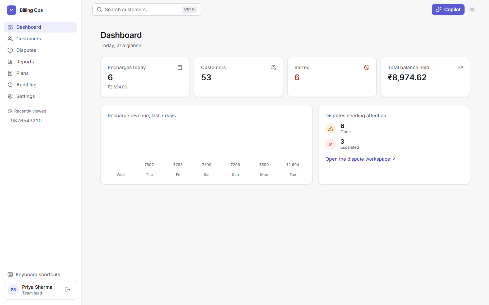 | 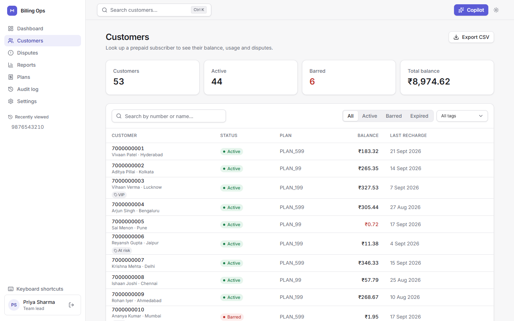 |

| Customer 360 | Reports |
|---|---|
| 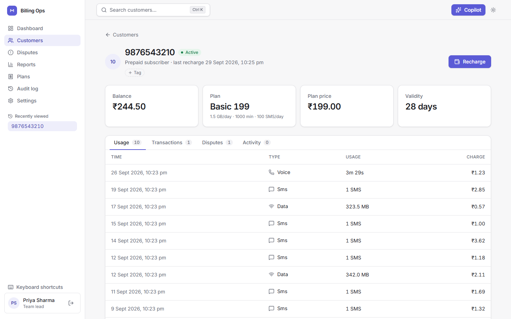 | 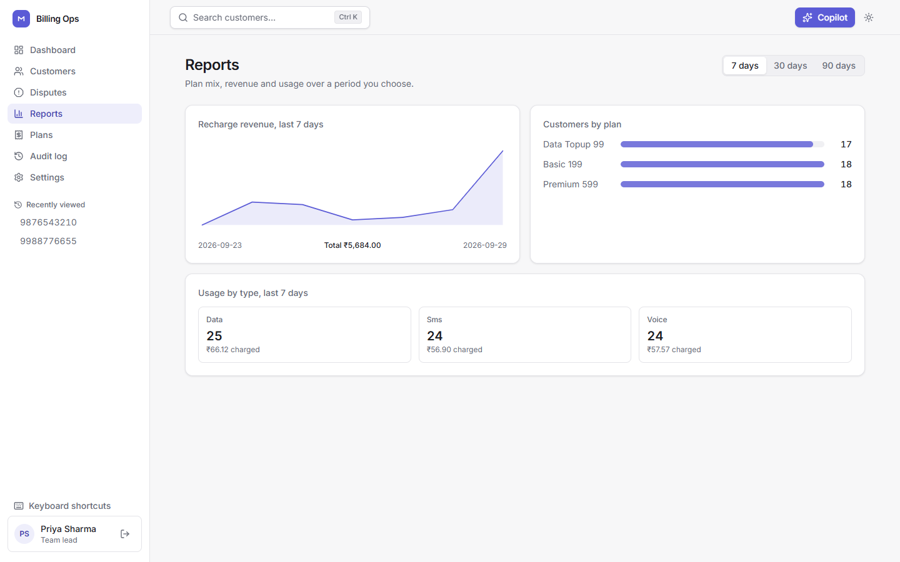 |

| Plan catalog | Audit log |
|---|---|
| 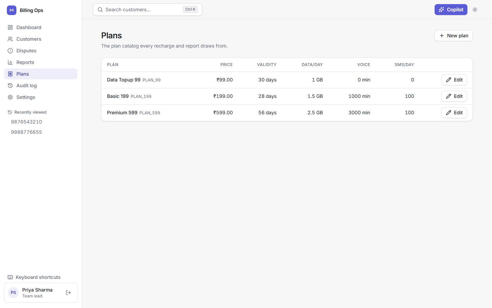 | 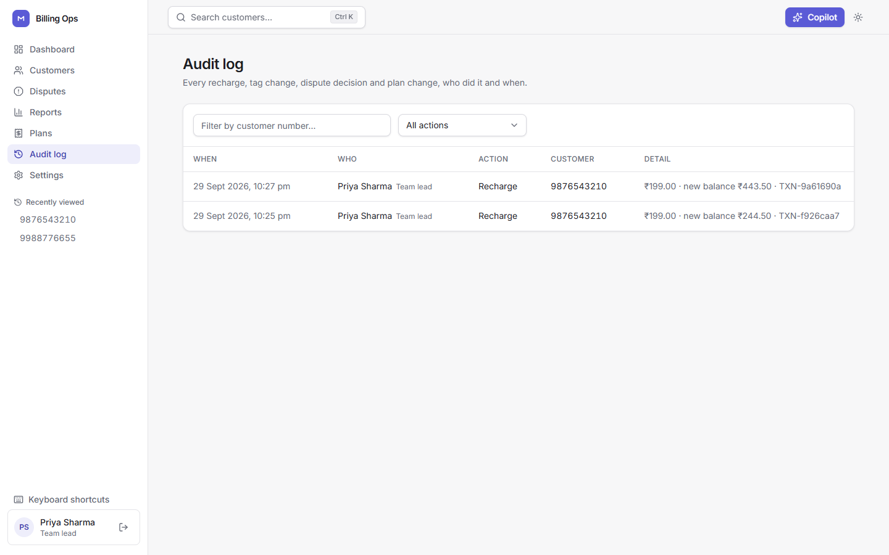 |

| Recharge: review step | Barred customer |
|---|---|
| 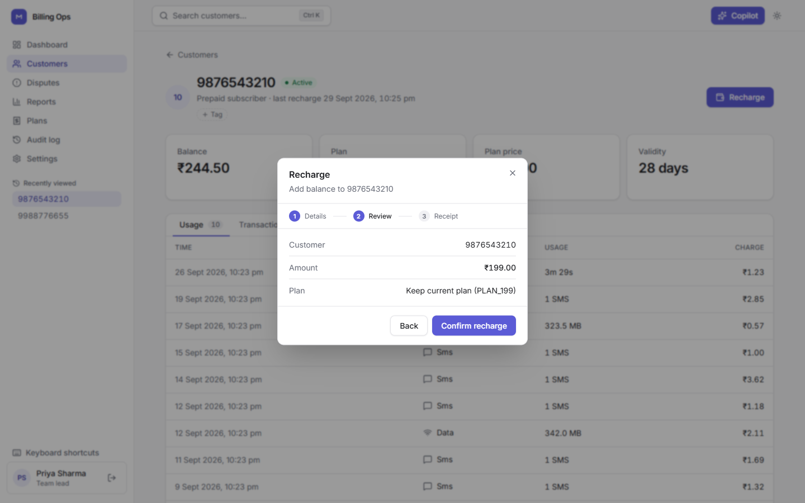 | 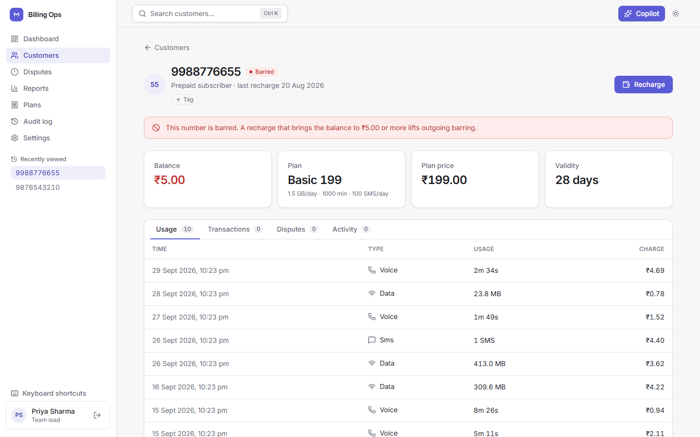 |

| ⌘K command palette | Dark theme (light, dark and system are all supported) |
|---|---|
| 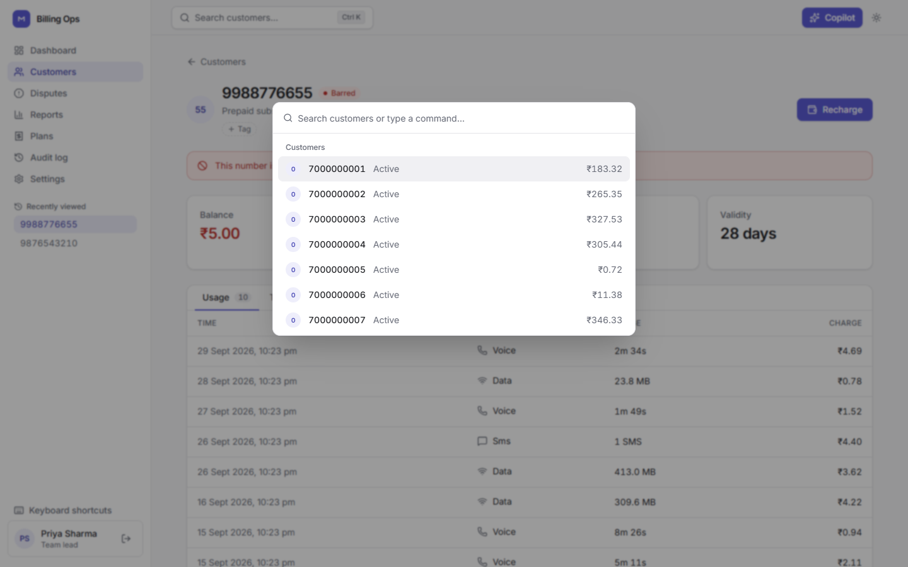 | 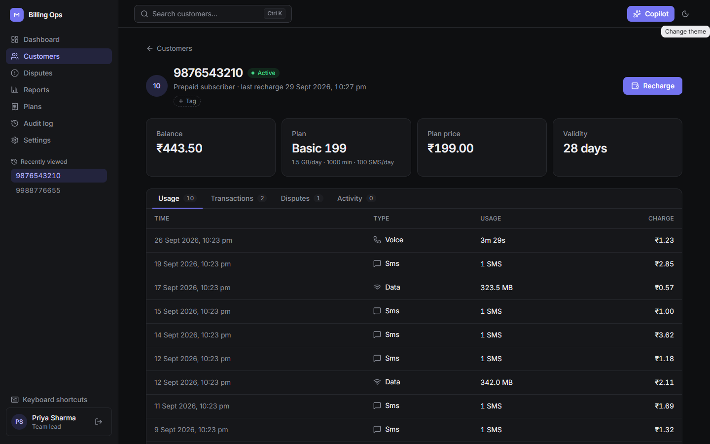 |

**The Copilot** answers a policy question from the knowledge base and then runs a browser test, showing the verdict and
the screenshot inline:

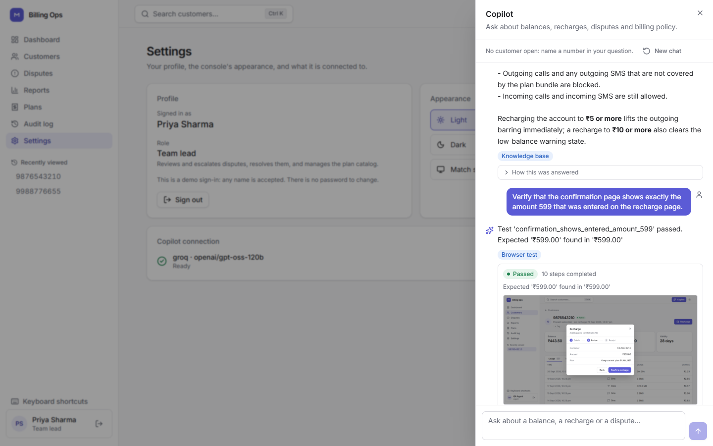

## What it does

| Route | Agent | Example |
|---|---|---|
| RAG | Answers only from 12 policy documents (Chroma), or says it does not know | "What happens when the balance goes below ₹5?" |
| Balance | Reads the billing API, phrases the reply | "What's the balance?" (uses the customer that is open) |
| Dispute | Registers a dispute, states the SLA; escalates on the SOP rule (amount over ₹500) | "I was charged twice, Rs 199, I want a refund" |
| Escalation | Registers if needed, escalates, returns a ticket | "Get me a manager" |
| Test-Gen | Writes a browser test from plain English and runs it with Playwright MCP, then shows the screenshot | "Verify that recharging 199 updates the balance" |

A **router** sends each message by regex first and an LLM classifier only when the regex cannot decide. Every reply
passes a **moderation** node: regex masking of phone numbers and transaction ids (a number the agent typed or has open is
echoed; any other is masked), then an LLM safety check. The answer streams to the browser step by step over SSE, with the
sources and billing calls behind it in "How this was answered".

## The rest of the console

Beyond the Copilot, the console has the CRM pieces a real support team would expect:

- **Customer profiles** — name, email, city and segment (Individual/Business) alongside the phone number, searchable
  by name as well as by number. 50 generated customers plus the 3 original demo fixtures, with usage, recharges and
  disputes spread realistically over the last 90 days, so lists, filters and charts have something real to show.
- **Dashboard** — today's recharges, barred count, total balance held, disputes needing attention, and a 7-day revenue
  chart, all real numbers from the database, not fixtures.
- **Dispute workspace** — every dispute across every customer in one table, filterable by status, with an approximate
  SLA countdown against the 10-working-day SOP target.
- **Reports** — plan mix, a revenue trend over 7/30/90 days, and usage totals by type, for a period you choose.
- **Plan catalog** — every plan a recharge or report draws from, with a team-lead-only create/edit form.
- **Audit log** — every recharge, tag change, dispute decision and plan change, who did it and when, filterable by
  customer or action, not just visible per customer.
- **Tags and notes** — free-form labels on a customer (VIP, At risk, ...), filterable from the customer list, and
  internal notes an agent can leave on an account (not visible to the customer).
- **Activity timeline** — usage, transactions, disputes and notes merged into one chronological feed per customer.
- **Settings** — the signed-in agent's profile and role, the theme, and the Copilot's live connection status.
- **Role-based actions** — only a team lead may escalate or resolve/reject a dispute or change the plan catalog,
  enforced by the server (a 403 for an agent), not just hidden in the UI; an agent still sees the disabled button and why.
- **Recently viewed, CSV export, keyboard shortcuts (`?`)** — the smaller conveniences a CRM has.

## Architecture

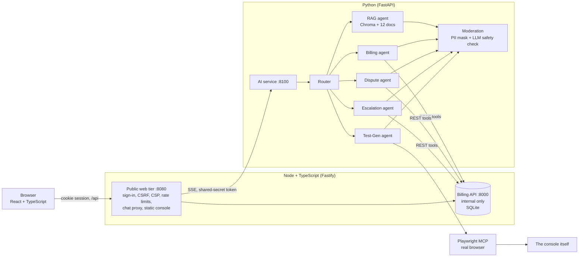

Why this split: the **web tier owns everything a browser touches** (sessions, validation, security headers, static
files), the **billing service owns the data**, and the **AI service is the only Python** because that is where the AI
libraries are. The AI service's OpenAPI file is the contract: the TypeScript types are generated from it, and a test
fails if they go stale. The same 19 HTTP checks run against the Node billing service and the Python reference
implementation (`mock_api/`), so the two cannot drift.

The LLM is one switch (`ACTIVE_PROVIDER`): Ollama for free local development, or Groq, Cloudflare, OpenAI or Anthropic.

## Run it locally

Needs Python 3.12+, Node.js 22.13+ and an LLM ([Ollama](https://ollama.com) locally, or a hosted key). Browser tests also
need Node.js (the Playwright MCP server is fetched on first use).

```powershell
python -m venv .venv; .venv\Scripts\activate
pip install -r requirements.txt
copy .env.example .env                 # set ACTIVE_PROVIDER (and its key), or run `ollama pull llama3.1:8b` for local
python scripts/dev.py --build          # billing API :8000, console :8080, AI service :8100
```

Open http://127.0.0.1:8080 and sign in with any name (demo login). The first Copilot question is slow while the models
load; the drawer says so. Useful flags: `--reseed` (fresh demo data), `--port/--billing-port/--ai-port`. The Node server
lists the built front-end files when it starts, so **restart after a front-end build** (`--build` does that).

To work on the front end with hot reload: `python scripts/dev.py` in one terminal, then `cd web; npm run dev`
(http://localhost:5173, proxied to the Node server).

## Run it in Docker

```bash
cp .env.example .env                   # set ACTIVE_PROVIDER and that provider's key (Ollama is not in the images)
docker compose up --build              # http://localhost:8080
```

`docker-compose.yml` runs two containers, `web` (Node) and `ai` (Python), and publishes only the console. The
`Dockerfile` has three targets: `web`, `ai`, and the default `app` (both in one container, which is what a Hugging Face
Space runs, via [deploy/start.sh](deploy/start.sh)). The image bakes in the embedding model and the prebuilt Chroma index.

## Deploy to Hugging Face Spaces

1. Create a Space with SDK **Docker** and push this repo. The front matter above sets `sdk: docker` and `app_port: 7860`.
2. In the Space settings add secrets: `ACTIVE_PROVIDER` (`groq`, `openai`, `anthropic` or `cloudflare`) and that provider's
   key. `SESSION_SECRET` and the internal token are generated at start if you do not set them.
3. Open the Space's direct `*.hf.space` URL, not the embedded view: the console refuses to be framed and its session
   cookie is first-party only.
4. Browser test runs are switched off there (`ENABLE_QA_RUNS=0`: no Playwright in the image); the other four routes work.

**Not verified:** I have not deployed a live Space, and I could not build the Docker images on the machine I developed
on (no running Docker daemon). What I did verify is the container entrypoint itself: `deploy/start.sh all` was run natively
against the compiled Node build in production mode (generated secrets, seeded database, both services up, a real answer
through the whole stack, internal billing routes not reachable on the public port). The first `docker compose up --build`
is the real test of the Dockerfile.

## Does it work? (measured, not claimed)

| Check | Result |
|---|---|
| Router accuracy, 15 hand-written queries | 15 / 15 (re-run after the latest router change) |
| Retrieval, one query per source document | 12 / 12 documents found in the top 4 |
| Answer quality (DeepEval, `gpt-4.1` judge, 15 fixtures) | 36 / 36 tests, 93 metric results, 0 judge errors, about $0.46 per full run |
| Browser QA agent, 5 recharge scenarios against the React console | 5 / 5 pass in a real browser; LLM-written scenarios pass too; also triggered from the Copilot |
| Can the QA agent fail? | Yes. With the UI deliberately broken (review step showing amount + 1; earlier, a double charge) the right scenarios failed with precise messages |
| Automated tests | Python 266 · Node 140 · React 58 · billing contract 19 on **both** implementations |

Details: [eval/README.md](eval/README.md) (thresholds, judge comparison, what the suite found) and
[tests_qa/README.md](tests_qa/README.md).

**Bugs the tests found, worth reading about:**
- **Two plan answers swapped** (Basic and Premium figures). Cause: chunks lost their plan name when split. Fix: prefix
  every chunk with its document title. Caught by the DeepEval suite; the first version of the suite missed one of the
  two, which led to adding an answer-vs-reference metric.
- **Two metrics scored backwards** relative to the spec (DeepEval 4.x Hallucination and Toxicity are higher-is-better).
  Tests now pin the direction.
- **A race in the retriever cache:** two threads building a Chroma client for the same folder broke each other. Found
  when the first question failed; fixed with a lock and a test that reproduced 8 clients for 8 callers.
- **A policy question was treated as a balance lookup:** "What happens when my balance drops below ₹5?" hit the balance
  keyword and asked for a phone number. Found by using the Copilot; process questions now go to the knowledge base.
- **The same bug came back for "dispute":** "How long does a dispute take to resolve?" was fixed for balance/recharge
  wording but not dispute/escalation wording, because the policy-question check ran after those keyword checks, not
  before. Reported by a user testing the live console. Fixed by checking policy phrasing first, unconditionally.
- **A CRM feature broke the browser QA agent without a single unit test failing:** adding customer profiles removed the
  literal text "Prepaid subscriber" from the customer page for anyone with a name on file, and every browser scenario
  (and the Test-Gen prompt) waits for exactly that text after sign-in. All 58 web tests still passed, because none of
  them exercise a real page-ready wait the way a real browser does. Caught by actually running the scenarios in a
  browser before calling the feature done, not by the unit suite; fixed by keeping that text fixed regardless of the
  profile, and a test now pins it.
- **Browser tests silently failed under a server that switches asyncio loops on Windows** (subprocess creation raised
  `NotImplementedError`). Fixed with a dedicated loop, with a test that reproduces it.
- **A missing asset returned the HTML page with status 200,** so a stale build showed a blank screen and a MIME error.
  Missing files are now a 404, with a test.
- **Every API call took 2 s on Windows** (`localhost` tried IPv6 first): 12 s per page. Now 16 ms.

## Security model

- **Two listeners, one database.** The billing API is unauthenticated and bound to loopback (or the compose network); the
  public web tier exposes only sign-in, `/api` and the console, and a test asserts the internal routes are not reachable
  through it.
- **Sessions** are a signed, `httpOnly`, `SameSite=Lax` cookie; expiry and role are re-checked on every request. Sign-in
  is a demo login (any name), not real authentication.
- **CSRF:** non-GET `/api` requests must come from the same origin. **CSP** allows only same-origin scripts and styles;
  fonts are self-hosted. **Rate limits** on sign-in and chat. Request bodies are validated with zod.
- **The AI service** requires a shared-secret header, caps concurrent chats, and serves evidence screenshots only for
  names matching a strict pattern (blocks path traversal, including Windows backslashes).
- **Browser tests** may only visit the console's own origin; steps come from an LLM, so this is enforced twice (when the
  scenario is validated and again when it runs).
- **Secrets** live in `.env` (git-ignored); the repo is scanned for key patterns before every commit.

## Tests

```powershell
$env:PYTHONPATH = "."
pytest mock_api rag agents ai_service eval/test_judge.py tests_qa contract_tests -m "not live"   # Python, offline
python -m contract_tests.run                                    # the 19 billing checks on the Node AND Python services
cd services/billing; npm test                                   # Node
cd web; npm test                                                # React (Vitest + Testing Library + MSW)
pytest eval -v                                                  # DeepEval: needs a judge, see eval/README.md
python scripts/dev.py --reseed                                  # then, in another terminal:
$env:RUN_E2E = "1"; python -m tests_qa.run_agent_tests          # browser QA against the running console
```

## Configuration

`.env` (see [.env.example](.env.example)): `ACTIVE_PROVIDER` picks the model, with `*_API_KEY` and `*_TEXT_MODEL` per
provider. `JUDGE_PROVIDER` / `JUDGE_MODEL` pick the DeepEval judge separately. `ENABLE_QA_RUNS=0` switches off the
browser-test route. `AI_SERVICE_TOKEN` is the shared secret between the web tier and the AI service. `scripts/dev.py`
wires the ports and URLs for you.

## Repository

```
web/            React + TypeScript console (Vite, Tailwind, Radix): customers, Customer 360, recharge, Copilot drawer
services/billing/  Node + TypeScript: billing API (internal), public web tier (sessions, /api, chat proxy, static hosting)
ai_service/     FastAPI: chat + SSE streaming, evidence screenshots, OpenAPI contract
agents/         router, RAG / billing / dispute / escalation / test-gen agents, moderation, LangGraph, LLM provider switch
rag/            ingest (title-prefixed chunks), thread-safe retriever; chroma_db/ is the prebuilt index
mock_api/       Python reference billing implementation (contract-tested against the Node one) and test double
contracts/      the AI service's OpenAPI file; the TypeScript types are generated from it
contract_tests/ the same HTTP checks run against both billing implementations
tests_qa/       Playwright MCP client, five scenarios, runner, evidence screenshots
eval/           DeepEval suite, judge adapter, fixtures, results, thresholds
langflow/       exported visual prototype of the RAG chain
scripts/        dev.py: start everything locally
deploy/         container entrypoint (start.sh)
docs/           screenshots and the scripts that capture them
```

## Honest limitations

- The sign-in is a demo login: any name works. The role you pick is real, though: escalating or resolving a dispute is
  enforced server-side as team-lead-only (a 403 for an agent, not just a hidden button), matching the two roles' own
  descriptions on the login page.
- The rate limiter and sessions are in memory and single-process; a multi-instance deployment needs a shared store.
- The RAG knowledge base is 12 short documents I wrote; answers are only as good as they are.
- A small local model (Llama 3.1 8B) is a weak safety classifier: it misses harmless-but-off-topic replies such as a code
  snippet. Regex masking of phone numbers is the actual guarantee; the LLM check is a second layer.
- The billing system is a demo (SQLite); browser scenarios recharge real rows, so they are opt-in (`RUN_E2E=1`) and
  `python scripts/dev.py --reseed` resets the data.
- The Docker images and the Space deployment are unverified (see above). Free hosted-LLM tiers run out of quota quickly.
- Eval fixtures are frozen answers and only change when regenerated. The earlier Streamlit console is gone from the tree;
  it is in the history at commit `c33fe84`.
