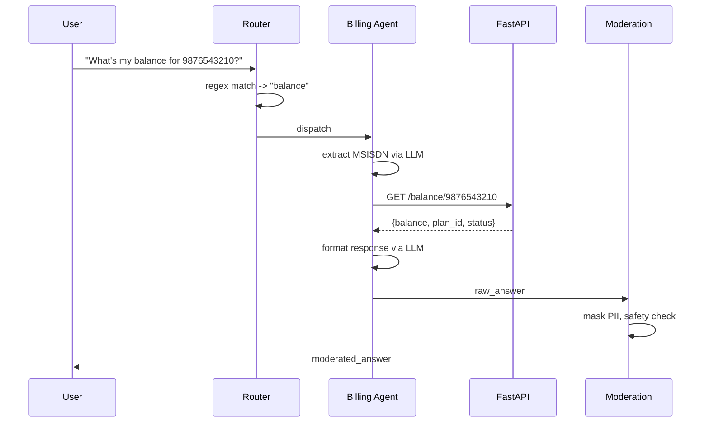
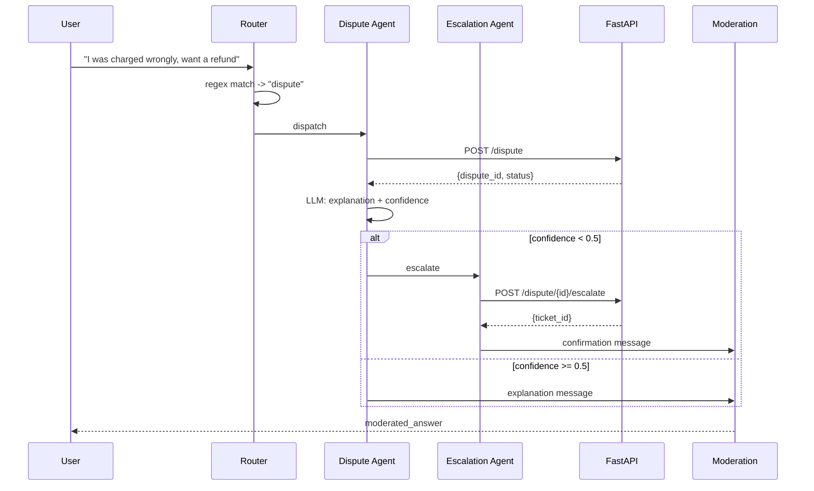
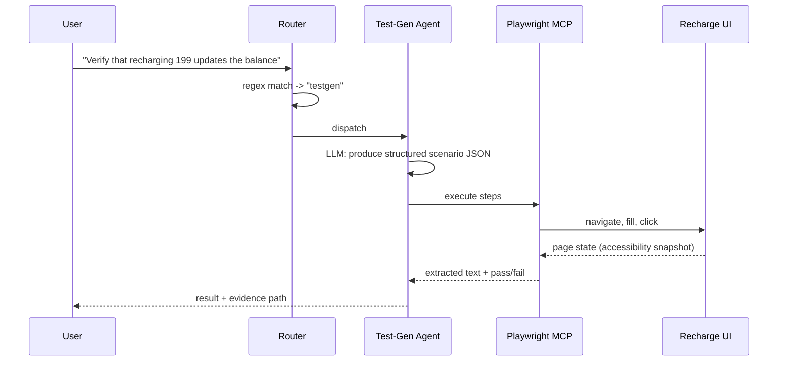

# Prepaid Billing Ops Copilot — Detailed Architecture

**Type:** Agentic GenAI system (RAG + multi-agent orchestration + automated QA)
**Domain:** Prepaid telecom billing (CDR, rating, recharge, disputes)
**Purpose:** Portfolio project demonstrating RAG, LangChain, LangGraph, Langflow, DeepEval, a moderation layer, and Playwright MCP-based autonomous UI testing.

---

## 1. System Overview

```
                        +-----------------------+
                        |   Streamlit Chat UI    |
                        +-----------+-----------+
                                    |
                                    v
                        +-----------------------+
                        |   Router Agent          |  regex fast-path -> LLM fallback
                        +-----------+-----------+
        +--------------------+------+------+--------------------+
        v                    v             v                    v
+---------------+  +----------------+ +-------------+  +--------------------+
| RAG Agent      |  | Billing Tool   | | Dispute      |  | Complaint-         |
| (Chroma)       |  | Agent (REST)   | | Agent        |  | Escalation Agent   |
+-------+-------+  +--------+-------+ +------+------+  +----------+---------+
        +--------------------+---------------+---------------------+
                                    v
                        +-----------------------+
                        |   Moderation Node       |  PII mask + LLM safety check
                        +-----------+-----------+
                                    v
                        +-----------------------+
                        |   Response to User      |
                        +-----------------------+

        Separate agent (invoked from same graph via a 5th route):
        Test-Gen Agent -> Playwright MCP Agent -> Mock Recharge UI (3-page Streamlit flow)

        Supporting tracks (not part of the runtime request path):
        - Langflow: visual prototype of Router+RAG, built alongside Phase 2-4
        - DeepEval: offline eval suite run against RAG/Dispute agent outputs
```

**Request lifecycle (single query, happy path):**
1. User submits query in Streamlit chat UI.
2. Router Agent runs regex fast-path; if no confident match, calls LLM classifier.
3. Router dispatches to one of 5 agent nodes via LangGraph conditional edge.
4. Agent node executes (may call FastAPI tool, may call retriever, may call sub-LLM).
5. Output passes through Moderation Node (PII regex mask, then LLM safety classifier).
6. Final state returned to Streamlit and rendered.
7. (Async, not in the request path) Every RAG/Dispute interaction logged to a JSONL file for later DeepEval regression runs.

---

## 2. Repository Structure

```
billing-copilot/
+-- .env                          # ANTHROPIC_API_KEY, OLLAMA_HOST, ENV=dev|demo
+-- requirements.txt
+-- README.md                     # showcase doc: diagram, screenshots, GIF, setup steps
+-- architecture.md                # this file
+-- data/
|   +-- docs/                     # 10+ source markdown docs (see section 6)
|   +-- billing.db                # SQLite file (generated by seed script)
+-- mock_api/
|   +-- main.py                   # FastAPI app
|   +-- models.py                 # Pydantic request/response schemas
|   +-- db.py                     # SQLite connection + schema DDL
|   +-- seed.py                   # populates sample subscribers/plans/CDRs
+-- rag/
|   +-- ingest.py                 # chunk + embed + persist to Chroma
|   +-- retriever.py              # get_retriever() helper
|   +-- chroma_db/                # PRE-BUILT, committed to repo
+-- agents/
|   +-- state.py                  # LangGraph TypedDict schema
|   +-- router.py                 # regex rules + LLM fallback classifier
|   +-- rag_agent.py
|   +-- billing_agent.py
|   +-- dispute_agent.py
|   +-- escalation_agent.py
|   +-- testgen_agent.py
|   +-- moderation.py             # PII regex + safety classifier node
|   +-- graph.py                  # StateGraph assembly, compiled app
|   +-- llm.py                    # single get_llm() function: Ollama <-> Claude switch
+-- tests_qa/                     # Playwright MCP test agent (standalone first)
|   +-- scenarios.py              # the 5+ natural-language test scenarios as data
|   +-- run_agent_tests.py        # standalone runner
|   +-- mcp_client.py             # MCP connection + tool-call wrapper
+-- eval/
|   +-- fixtures.jsonl            # logged real interactions for regression
|   +-- test_rag.py               # DeepEval: Faithfulness, Relevancy, Hallucination, Ctx Precision/Recall
|   +-- test_safety.py            # DeepEval: Toxicity
+-- ui/
|   +-- chat_app.py               # main Streamlit chat UI (calls agents/graph.py)
|   +-- recharge_app.py           # 3-page mock recharge flow (Playwright test target)
+-- langflow/
|   +-- billing_copilot_flow.json # exported Langflow prototype
+-- deploy/
    +-- app.py                    # HF Spaces entrypoint (wraps chat_app.py)
    +-- packages.txt              # system deps for HF Spaces, if any
```

---

## 3. Data Models

### 3.1 SQLite schema (`mock_api/db.py`)

```sql
CREATE TABLE subscribers (
    msisdn TEXT PRIMARY KEY,
    plan_id TEXT,
    balance REAL NOT NULL DEFAULT 0,
    status TEXT DEFAULT 'active',       -- active | barred | expired
    last_recharge_date TEXT
);

CREATE TABLE plans (
    plan_id TEXT PRIMARY KEY,
    name TEXT,
    price REAL,
    validity_days INTEGER,
    data_per_day_gb REAL,
    voice_minutes INTEGER,
    sms_per_day INTEGER
);

CREATE TABLE cdrs (
    cdr_id TEXT PRIMARY KEY,
    msisdn TEXT,
    call_type TEXT,                     -- voice | sms | data
    duration_sec INTEGER,
    data_mb REAL,
    charge REAL,
    timestamp TEXT,
    FOREIGN KEY (msisdn) REFERENCES subscribers(msisdn)
);

CREATE TABLE disputes (
    dispute_id TEXT PRIMARY KEY,
    msisdn TEXT,
    reason TEXT,
    amount_disputed REAL,
    status TEXT DEFAULT 'open',         -- open | escalated | resolved | rejected
    created_at TEXT,
    FOREIGN KEY (msisdn) REFERENCES subscribers(msisdn)
);

CREATE TABLE transactions (
    txn_id TEXT PRIMARY KEY,
    msisdn TEXT,
    type TEXT,                          -- recharge | deduction | refund
    amount REAL,
    balance_after REAL,
    timestamp TEXT
);
```

### 3.2 FastAPI endpoints (`mock_api/models.py` + `main.py`)

| Method | Path | Request body | Response |
|---|---|---|---|
| GET | `/balance/{msisdn}` | - | `{msisdn, balance, plan_id, status}` |
| GET | `/plans/{plan_id}` | - | `{plan_id, name, price, validity_days, data_per_day_gb, ...}` |
| POST | `/recharge` | `{msisdn, amount, plan_id}` | `{txn_id, new_balance, status}` |
| GET | `/cdr/{msisdn}?limit=10` | - | `[{cdr_id, call_type, charge, timestamp}, ...]` |
| POST | `/dispute` | `{msisdn, reason, amount_disputed}` | `{dispute_id, status}` |
| GET | `/dispute/{dispute_id}` | - | `{dispute_id, status, reason, amount_disputed}` |
| POST | `/dispute/{dispute_id}/escalate` | `{}` | `{dispute_id, status: "escalated", ticket_id}` |

Pydantic models mirror this table 1:1 in `mock_api/models.py` — keep request/response schemas strict (no `dict` passthrough) so agent tool-calling has a stable contract to bind to.

### 3.3 LangGraph state schema (`agents/state.py`)

```python
from typing import TypedDict, Optional, Literal

class AgentState(TypedDict):
    query: str
    msisdn: Optional[str]                 # extracted or provided
    route: Literal["rag", "balance", "dispute", "escalation", "testgen"]
    route_method: Literal["regex", "llm"] # for logging/eval
    retrieved_context: Optional[list[str]]
    raw_answer: Optional[str]
    moderated_answer: Optional[str]
    pii_masked: bool
    safety_flag: Optional[str]            # None if clean, else category
    tool_calls: list[dict]                # log of any REST calls made
    escalation_ticket_id: Optional[str]
    test_scenario: Optional[dict]         # populated only on testgen route
    test_result: Optional[dict]           # pass/fail + evidence path
```

Keeping this explicit (rather than a loose dict) is itself a talking point — it shows deliberate state design, and makes DeepEval logging trivial since every field you'd want to evaluate is already named.

---

## 4. Phase-by-Phase Plan (detailed)

### Phase 0 — Environment Setup
**Tasks:**
- Create venv, install `requirements.txt` (see section 8)
- Install Ollama, pull `llama3.1:8b`; verify with `ollama run llama3.1:8b "hello"`
- Install Node 18+, run `npx @playwright/mcp@latest --version` to confirm MCP server works
- Create `.env` with `ANTHROPIC_API_KEY` and `ENV=dev`
- `agents/llm.py`: single `get_llm(env)` function returning either `ChatOllama(model="llama3.1:8b")` or `ChatAnthropic(model="claude-sonnet-4-6")` based on `ENV`
**Acceptance criteria:** `python -c "from agents.llm import get_llm; print(get_llm('dev').invoke('hi'))"` returns a response.
**Effort:** 0.5–1 day

### Phase 1 — Mock Billing REST API
**Tasks:**
- Write DDL (section 3.1) into `mock_api/db.py`, run once to create `data/billing.db`
- `mock_api/seed.py`: insert 5–10 sample subscribers, 3–4 plans, 20–30 sample CDRs, 2–3 open disputes
- Implement all 7 endpoints (section 3.2) in `mock_api/main.py` using the Pydantic models
- Write 5–6 `pytest` tests against the API directly (not via agents yet) — recharge increases balance correctly, invalid MSISDN returns 404, dispute creation returns a valid ID, etc.
**Acceptance criteria:** `uvicorn mock_api.main:app` runs; `curl localhost:8000/balance/9876543210` returns seeded data; `pytest mock_api/` passes.
**Effort:** 1.5–2 days

### Phase 2 — Knowledge Base & RAG Chain
**Tasks:**
- Author 10+ docs in `data/docs/` (full list in section 6) — 300–800 words each, your own domain writing
- `rag/ingest.py`: load, chunk (800 chars / 100 overlap — tune after inspecting retrieval quality), embed with MiniLM, persist to `rag/chroma_db/`
- `rag/retriever.py`: `get_retriever(k=4)` helper
- Manual test: run 10 sample questions against the retriever + a plain LLM chain (no LangGraph yet), eyeball groundedness before moving on
**Acceptance criteria:** For each of the 10 docs, at least one test query correctly retrieves that doc's chunk in the top-4 results.
**Effort:** 3–4 days (mostly doc writing)

### Phase 3 — Langflow Prototype
**Tasks:**
- `langflow run`, build: Chroma loader -> Retriever -> Prompt template -> LLM node -> Chat output
- Test the same 10 sample queries through the Langflow UI
- Export flow JSON to `langflow/billing_copilot_flow.json`, screenshot for README
**Acceptance criteria:** Flow runs end-to-end in the Langflow UI without errors; export file committed.
**Effort:** 0.5 day

### Phase 4 — LangGraph Multi-Agent Orchestration
**Tasks (build and test one node at a time — do not write all 5 before testing the first):**
1. `agents/router.py`: regex rules (msisdn pattern + keywords "balance"/"recharge" -> balance; "dispute"/"wrong charge"/"refund" -> dispute; "escalate"/"complaint"/"manager" -> escalation; "test"/"verify"/"check that ... works" -> testgen; else -> LLM fallback classifying into the same 5 labels)
2. `agents/rag_agent.py`: retriever + LLM chain from Phase 2, wrapped as a node
3. `agents/billing_agent.py`: extracts MSISDN from query (regex `\b\d{10}\b`, fallback to asking for it), calls `/balance` or `/recharge`, formats response
4. `agents/dispute_agent.py`: RAG (dispute SOP doc) + calls `/dispute` endpoint, decides confidence; if low confidence or escalation keywords present, sets a flag for escalation_agent
5. `agents/escalation_agent.py`: calls `/dispute/{id}/escalate`, returns a ticket ID and human-handoff message
6. `agents/testgen_agent.py`: takes a plain-English requirement, calls LLM to produce a structured test scenario dict (target page, steps, expected assertion) matching the shape consumed by `tests_qa/scenarios.py`
- `agents/graph.py`: wire all 6 nodes (router + 5) with conditional edges, add moderation node after every terminal agent, compile
**Acceptance criteria:** `app.invoke({"query": "..."})` produces correct routing for at least 15 manually-written test queries (3 per agent), logged to a simple CSV to eyeball routing accuracy.
**Effort:** 4–5 days

### Phase 5 — Moderation Layer
**Tasks:**
- `agents/moderation.py`: regex for MSISDN (`\b\d{10}\b`) and account/dispute IDs, mask to `[MASKED]`
- LLM safety classifier: prompt returns `{"safe": bool, "category": str|null}` for off-topic/unsafe content; wire as a second step in the same node
- Unit tests: 5 inputs with PII (must be masked), 5 safe inputs (must pass through unchanged), 3 adversarial/off-topic inputs (must be flagged)
**Acceptance criteria:** All moderation unit tests pass; a query containing a phone number never reaches the final response unmasked.
**Effort:** 1 day

### Phase 6 — DeepEval Suite
**Tasks:**
- `eval/fixtures.jsonl`: 15–20 real (query, retrieved_context, answer) triples captured from Phase 4 testing
- `eval/test_rag.py`: for each fixture, assert Faithfulness >= 0.7, Answer Relevancy >= 0.7, Hallucination <= 0.3, Contextual Precision >= 0.6, Contextual Recall >= 0.6
- `eval/test_safety.py`: Toxicity metric against both clean and adversarial fixtures
- Document exact thresholds and rationale in `eval/README.md`
**Acceptance criteria:** `deepeval test run eval/` passes on current fixtures; re-running after a prompt change shows measurable score deltas (this is your "regression suite" demo moment).
**Effort:** 2 days

### Phase 7 — Mock Recharge UI + Playwright MCP Test Agent
**Tasks:**
- `ui/recharge_app.py`: 3-page Streamlit flow using `st.session_state` for page routing
  - Page 1 (Recharge): MSISDN input, amount input, plan dropdown, "Continue" button
  - Page 2 (Confirmation): shows entered details, "Confirm" / "Back" buttons
  - Page 3 (Receipt): transaction ID, new balance, timestamp, "Done" button
- `tests_qa/scenarios.py`: define 5+ scenarios as structured data, e.g.:
  1. Valid recharge end-to-end (happy path, all 3 pages)
  2. Invalid MSISDN rejected on page 1
  3. Confirmation page shows exact amount entered (no rounding/mismatch bugs)
  4. Receipt page balance = pre-balance + recharge amount (cross-check against `/balance` API)
  5. Back navigation from confirmation does not create a duplicate transaction
- `tests_qa/mcp_client.py`: wrapper connecting to the Playwright MCP server, exposing `navigate()`, `fill()`, `click()`, `read_text()` as callables the Test-Gen Agent's output maps onto
- `tests_qa/run_agent_tests.py`: standalone script — loads a scenario, calls Test-Gen Agent (Phase 4) to get the structured steps, executes via MCP client, asserts, prints pass/fail with a screenshot saved to `tests_qa/evidence/`
- Once stable: add a `testgen` case in `agents/graph.py` that calls this same execution function and returns the result into `AgentState.test_result`
**Acceptance criteria:** All 5 scenarios pass standalone; at least the happy-path scenario also passes when triggered via the main chat UI.
**Effort:** 3–4 days

### Phase 8 — Integration, Polish & Deployment
**Tasks:**
- `ui/chat_app.py`: Streamlit chat calling `agents/graph.py`, rendering moderated answers, showing test evidence images inline when route is `testgen`
- Commit `rag/chroma_db/` (pre-built index) to the repo — add a `.gitattributes`/size check if it's large
- `deploy/app.py`: HF Spaces entrypoint; set `ENV=demo` so `get_llm()` resolves to Claude API; add `ANTHROPIC_API_KEY` as an HF Spaces secret (never commit it)
- README: architecture diagram (from section 1), screenshots of chat UI + recharge flow + a DeepEval run + a Playwright pass/fail log, and an embedded demo GIF (record with a free tool like ScreenToGif or Peek)
**Acceptance criteria:** Public HF Spaces URL loads the chat UI, answers a RAG question correctly, and completing a recharge test scenario produces visible pass/fail output — all without you running anything locally.
**Effort:** 2 days

**Total estimated effort:** ~18–21 working days, i.e. roughly 10–12 weekends part-time.

---

## 5. Knowledge Base — Document List (Phase 2)

| # | Doc | Content |
|---|---|---|
| 1 | `cdr_spec.md` | CDR field definitions: call type, duration, timestamp, charge calculation basis |
| 2 | `rating_plan_basic.md` | ₹199 plan: validity, data/day, voice, SMS limits |
| 3 | `rating_plan_premium.md` | ₹599 plan: validity, data/day, voice, SMS limits, extra benefits |
| 4 | `rating_plan_topup.md` | Data-only top-up packs, validity rules |
| 5 | `dispute_resolution_sop.md` | Step-by-step dispute handling, timelines, escalation criteria |
| 6 | `trai_prepaid_summary.md` | Public TRAI regulations relevant to prepaid billing (validity, lapsing rules) |
| 7 | `recharge_policy.md` | How recharges are applied, partial recharge rules, failed recharge handling |
| 8 | `roaming_charges.md` | Domestic roaming rating rules |
| 9 | `plan_validity_expiry.md` | What happens on expiry, grace period, service barring |
| 10 | `low_balance_barring.md` | Thresholds for outgoing/incoming barring |
| 11 | `refund_policy.md` | When refunds are issued, timelines, method |
| 12 | `faq.md` | 15–20 common subscriber questions, short answers |

---

## 6. requirements.txt (reference)

```
langchain
langchain-anthropic
langchain-community
langchain-ollama
langgraph
chromadb
sentence-transformers
fastapi
uvicorn
streamlit
deepeval
pydantic
python-dotenv
pytest
```
(Playwright MCP is installed separately via `npx @playwright/mcp@latest` — Node package, not pip.)

---

## 7. Risks & Mitigations

| Risk | Mitigation |
|---|---|
| Local 8B model gives inconsistent routing during dev | Hybrid router relies on regex for the obvious cases; only ambiguous queries hit the LLM, limiting blast radius |
| Chroma index committed to repo grows large | Keep doc set to markdown/text only (no embedded images); 12 docs at this size should stay well under a few MB |
| HF Spaces free tier cold-start latency | Pre-built index (Phase 8) removes the biggest startup cost; keep Streamlit app lightweight |
| Playwright MCP flakiness against Streamlit's dynamic DOM | Use explicit waits/read_text polling in `mcp_client.py` rather than fixed sleeps; keep scenarios focused on stable element text |
| Scope creep (5 agents + multi-page UI + full eval suite is a lot) | Phase boundaries are hard checkpoints — each phase has its own acceptance criteria and is independently demoable if later phases slip |

---

## 8. Decision Log (finalized)

| # | Decision | Choice |
|---|---|---|
| 1 | LLM provider | Ollama/Llama 3.1 8B (dev) -> Claude API (final demo) |
| 2 | Local dev model | Llama 3.1 8B |
| 3 | Vector store | Chroma |
| 4 | Embedding model | MiniLM-L6-v2 (local) |
| 5 | Billing backend store | SQLite |
| 6 | Number of agents | 5 (RAG, Billing Tool, Dispute, Complaint-Escalation, Test-Gen) |
| 7 | Router logic | Hybrid — regex first, LLM fallback |
| 8 | Moderation scope | Rule-based PII mask + LLM safety classifier |
| 9 | DeepEval metrics | Full suite: Faithfulness, Relevancy, Hallucination, Contextual Precision, Contextual Recall, Toxicity |
| 10 | Playwright MCP agent location | Standalone script first -> wired into LangGraph as a node |
| 11 | Deployment target | Hugging Face Spaces |
| 12 | Vector index strategy | Pre-built, committed to repo |
| 13 | Number of source docs | 12 |
| 14 | Mock recharge UI complexity | Multi-page: recharge -> confirmation -> receipt |
| 15 | Showcase format | README with embedded diagram, screenshots, and demo GIF |

---

## 9. Success Criteria

- [ ] End-to-end chat query answered correctly and grounded in source docs (RAG)
- [ ] All 5 agent types reachable and correctly routed via the hybrid router
- [ ] PII masked in at least one demoable response
- [ ] DeepEval full suite passes with documented thresholds, runnable via one command
- [ ] At least 5 Playwright MCP-driven test scenarios pass against the 3-page mock recharge UI, both standalone and via the chat graph
- [ ] Langflow prototype export included in repo
- [ ] Live HF Spaces demo link + README with diagram, screenshots, and GIF

---

## 10. Agent Prompt Templates (exact, ready to paste into code)

### 10.1 Router — LLM fallback prompt (`agents/router.py`)
```
SYSTEM: You are a strict intent classifier for a prepaid telecom billing assistant.
Classify the user's query into exactly one label from this list:
- rag        : general questions about plans, rating rules, CDR, regulations, policies
- balance    : checking balance, recharging, plan details for a specific subscriber
- dispute    : billing disputes, wrong charges, refund requests
- escalation : explicit requests to escalate, speak to a manager, file a complaint
- testgen    : requests to test/verify/check that a feature or flow works correctly

Respond with ONLY the label, lowercase, no punctuation, no explanation.

USER QUERY: {query}
```
Parse the raw output with `.strip().lower()`; if it's not one of the 5 labels, default to `rag`.

### 10.2 Router — regex fast-path (`agents/router.py`)
```python
import re

MSISDN_PATTERN = r"\b\d{10}\b"

ROUTES = [
    ("escalation", re.compile(r"\b(escalate|manager|complaint|file a case|supervisor)\b", re.I)),
    ("dispute",    re.compile(r"\b(dispute|wrong charge|overcharg|refund|incorrect (bill|charge))\b", re.I)),
    ("testgen",    re.compile(r"\b(test|verify|check that|make sure .* works|validate the (ui|flow|page))\b", re.I)),
    ("balance",    re.compile(r"\b(balance|recharge|top ?up|plan details|my (plan|account))\b", re.I)),
]

def regex_route(query: str) -> str | None:
    for label, pattern in ROUTES:
        if pattern.search(query):
            return label
    return None  # falls through to LLM classifier
```
Order matters: escalation and dispute are checked before balance, since "I want to dispute my recharge" should not match the balance keyword "recharge" first.

### 10.3 RAG Agent prompt (`agents/rag_agent.py`)
```
SYSTEM: You are a prepaid telecom billing assistant. Answer ONLY using the provided
context. If the context does not contain the answer, say clearly that you don't have
that information rather than guessing. Keep answers under 120 words. Do not invent
plan names, prices, or regulations not present in the context.

CONTEXT:
{retrieved_chunks}

QUESTION: {query}
```

### 10.4 Billing Tool Agent — MSISDN extraction + response prompt (`agents/billing_agent.py`)
```
SYSTEM: Extract a 10-digit Indian mobile number (MSISDN) from the user's message if
present. Respond with ONLY the 10 digits, or the word NONE if no number is present.

MESSAGE: {query}
```
```
SYSTEM: You are a prepaid billing assistant. Given this raw API response, write a
short, friendly, factual answer to the user's question. Do not add information not
present in the API response.

API RESPONSE (JSON): {api_response}
USER QUESTION: {query}
```

### 10.5 Dispute Agent prompt (`agents/dispute_agent.py`)
```
SYSTEM: You are a billing dispute-resolution assistant. Using the dispute-resolution
SOP context below and the subscriber's dispute record, determine:
1. A short explanation for the user
2. A confidence score 0-1 for whether this can be resolved without human escalation
Respond as JSON: {{"explanation": "...", "confidence": 0.0}}

SOP CONTEXT:
{retrieved_chunks}

DISPUTE RECORD (JSON): {dispute_record}
USER QUERY: {query}
```
Escalation trigger rule in code (not left to the LLM alone): `if confidence < 0.5 or ESCALATION_KEYWORDS.search(query): route_to("escalation")`.

### 10.6 Complaint-Escalation Agent prompt (`agents/escalation_agent.py`)
```
SYSTEM: You are confirming an escalation to a human billing specialist. Given the
dispute reason and the new ticket ID, write a short, reassuring confirmation message
to the subscriber, including the ticket ID and a realistic expected resolution window
(refer to the SOP context for the correct SLA).

SOP CONTEXT:
{retrieved_chunks}

DISPUTE REASON: {reason}
TICKET ID: {ticket_id}
```

### 10.7 Test-Gen Agent prompt (`agents/testgen_agent.py`)
```
SYSTEM: Convert this plain-English QA requirement into a structured test scenario.
Respond as JSON matching this schema exactly:
{{
  "scenario_name": "string",
  "target_page": "recharge | confirmation | receipt",
  "steps": [
    {{"action": "navigate|fill|click|read_text", "target": "css selector or url", "value": "string or null"}}
  ],
  "assertion": {{"target": "css selector", "expected_contains": "string"}}
}}

REQUIREMENT: {requirement}
```

### 10.8 Moderation — safety classifier prompt (`agents/moderation.py`)
```
SYSTEM: Classify whether this assistant response is safe to show a telecom billing
customer. Flag if it is off-topic (unrelated to billing/telecom), contains unmasked
personal data, or contains anything inappropriate. Respond as JSON:
{{"safe": true/false, "category": "off_topic|unmasked_pii|inappropriate|null"}}

RESPONSE TO CHECK: {response}
```

---

## 11. Moderation — Full Regex Set (`agents/moderation.py`)

```python
import re

PII_PATTERNS = {
    "msisdn":     re.compile(r"\b\d{10}\b"),
    "dispute_id": re.compile(r"\bD-\d{6,}\b"),
    "txn_id":     re.compile(r"\bTXN-\d{6,}\b"),
}

def mask_pii(text: str) -> str:
    for label, pattern in PII_PATTERNS.items():
        text = pattern.sub(f"[MASKED_{label.upper()}]", text)
    return text
```
Apply `mask_pii` BEFORE the LLM safety classifier call, so the classifier never sees raw PII either (defense in depth, and reduces what you send to the API).

---

## 12. Playwright MCP — Full Scenario Definitions (`tests_qa/scenarios.py`)

Each scenario below is the literal structure the Test-Gen Agent should produce (section 10.7) and the MCP client executes step by step.

**Scenario 1 — Valid recharge end-to-end**
```python
{
  "scenario_name": "valid_recharge_e2e",
  "target_page": "recharge",
  "steps": [
    {"action": "navigate", "target": "http://localhost:8501", "value": None},
    {"action": "fill", "target": "#msisdn_input", "value": "9876543210"},
    {"action": "fill", "target": "#amount_input", "value": "199"},
    {"action": "click", "target": "#plan_dropdown_199", "value": None},
    {"action": "click", "target": "#continue_btn", "value": None},
    {"action": "click", "target": "#confirm_btn", "value": None},
    {"action": "read_text", "target": "#receipt_txn_id", "value": None},
    {"action": "read_text", "target": "#receipt_balance", "value": None}
  ],
  "assertion": {"target": "#receipt_balance", "expected_contains": "244.50"}  # 45.50 seed + 199
}
```

**Scenario 2 — Invalid MSISDN rejected**
```python
{
  "scenario_name": "invalid_msisdn_rejected",
  "target_page": "recharge",
  "steps": [
    {"action": "navigate", "target": "http://localhost:8501", "value": None},
    {"action": "fill", "target": "#msisdn_input", "value": "123"},
    {"action": "fill", "target": "#amount_input", "value": "199"},
    {"action": "click", "target": "#continue_btn", "value": None},
    {"action": "read_text", "target": "#error_message", "value": None}
  ],
  "assertion": {"target": "#error_message", "expected_contains": "Enter a valid 10-digit number"}
}
```

**Scenario 3 — Confirmation page shows exact amount**
```python
{
  "scenario_name": "confirmation_amount_matches",
  "target_page": "confirmation",
  "steps": [
    {"action": "navigate", "target": "http://localhost:8501", "value": None},
    {"action": "fill", "target": "#msisdn_input", "value": "9876543210"},
    {"action": "fill", "target": "#amount_input", "value": "599"},
    {"action": "click", "target": "#continue_btn", "value": None},
    {"action": "read_text", "target": "#confirm_amount_display", "value": None}
  ],
  "assertion": {"target": "#confirm_amount_display", "expected_contains": "599"}
}
```

**Scenario 4 — Receipt balance cross-checked against API**
```python
{
  "scenario_name": "receipt_balance_matches_api",
  "target_page": "receipt",
  "steps": [
    {"action": "navigate", "target": "http://localhost:8501", "value": None},
    {"action": "fill", "target": "#msisdn_input", "value": "9876543210"},
    {"action": "fill", "target": "#amount_input", "value": "99"},
    {"action": "click", "target": "#continue_btn", "value": None},
    {"action": "click", "target": "#confirm_btn", "value": None},
    {"action": "read_text", "target": "#receipt_balance", "value": None}
  ],
  "assertion": {"target": "#receipt_balance", "expected_contains": "<value fetched live via GET /balance/9876543210 before the test runs>"}
}
```
Note: this scenario's expected value is computed at test-run time in `run_agent_tests.py` (call the FastAPI balance endpoint first), not hardcoded — this is the scenario that most convincingly demonstrates cross-system verification in a demo.

**Scenario 5 — Back navigation does not double-charge**
```python
{
  "scenario_name": "back_nav_no_double_charge",
  "target_page": "confirmation",
  "steps": [
    {"action": "navigate", "target": "http://localhost:8501", "value": None},
    {"action": "fill", "target": "#msisdn_input", "value": "9876543210"},
    {"action": "fill", "target": "#amount_input", "value": "99"},
    {"action": "click", "target": "#continue_btn", "value": None},
    {"action": "click", "target": "#back_btn", "value": None},
    {"action": "click", "target": "#continue_btn", "value": None},
    {"action": "click", "target": "#confirm_btn", "value": None},
    {"action": "read_text", "target": "#receipt_balance", "value": None}
  ],
  "assertion": {"target": "#receipt_balance", "expected_contains": "<pre-balance + 99, single charge only>"}
}
```

**MCP client tool mapping (`tests_qa/mcp_client.py`):**
| scenario action | Playwright MCP tool call |
|---|---|
| navigate | `browser_navigate(url)` |
| fill | `browser_type(selector, text)` |
| click | `browser_click(selector)` |
| read_text | `browser_snapshot()` then extract text at selector |

Use `browser_snapshot()` (accessibility tree) rather than screenshots for assertions — faster, deterministic, matches how Playwright MCP is designed to be used (per Microsoft's own guidance, this is the structured-data mode vs the vision/screenshot mode).

---

## 13. Sequence Diagrams (Mermaid — paste into README or view in any Mermaid renderer)

### 13.1 Balance query flow


### 13.2 Dispute -> Escalation flow


### 13.3 Test-Gen -> Playwright MCP flow


---

## 14. Config & Environment Reference

`.env`:
```
ENV=dev                      # dev | demo  -- controls which LLM get_llm() returns
ANTHROPIC_API_KEY=sk-...     # only required when ENV=demo
OLLAMA_HOST=http://localhost:11434
FASTAPI_BASE_URL=http://localhost:8000
CHROMA_PERSIST_DIR=rag/chroma_db
LOG_LEVEL=INFO
```

`agents/llm.py`:
```python
import os
from langchain_ollama import ChatOllama
from langchain_anthropic import ChatAnthropic

def get_llm():
    if os.getenv("ENV") == "demo":
        return ChatAnthropic(model="claude-sonnet-4-6")
    return ChatOllama(model="llama3.1:8b", base_url=os.getenv("OLLAMA_HOST"))
```

HF Spaces secrets (set in Space settings, never committed): `ANTHROPIC_API_KEY`, `ENV=demo`.

---

## 15. Logging & Observability

- Every agent node writes one line to `logs/interactions.jsonl`: `{timestamp, query, route, route_method, agent, tool_calls, answer_length, safety_flag}`.
- This file is the source for `eval/fixtures.jsonl` (Phase 6) — periodically curate real interactions into eval fixtures rather than hand-writing all of them.
- No PII is logged in raw form — log the masked version only, reusing `mask_pii()` from section 11 before writing to disk.
- For the demo, a small "routing accuracy" script reads this log and prints a confusion-matrix-style summary — a nice, cheap-to-build artifact for interviews ("here's how I validated my router").

---

## 16. Error Handling Matrix

| Failure point | Behavior |
|---|---|
| FastAPI unreachable | Billing/Dispute agents catch `ConnectionError`, return a graceful "billing system temporarily unavailable" message, log the failure |
| MSISDN not found in DB | Return a clear "no subscriber found for this number" message, do not fabricate data |
| LLM API timeout (Claude, demo mode) | Retry once with exponential backoff (1 retry, 2s delay); on second failure, fall back to a static "I'm having trouble right now" message |
| Ollama not running (dev mode) | Fail fast at startup with a clear error pointing to `ollama serve`, rather than a cryptic connection error mid-conversation |
| Playwright MCP element not found | Scenario reports `"result": "fail", "reason": "selector not found: <selector>"` rather than crashing the whole test run |
| DeepEval metric below threshold | Test fails visibly in `pytest`/`deepeval` output with the actual score, not silently skipped |

---

## 17. Suggested Git Workflow & Milestones

- `main` branch always demoable; work in `phase-N-<name>` branches, merge after that phase's acceptance criteria (section 4) pass.
- Tag `v0.1` after Phase 4 (core agents working), `v0.2` after Phase 7 (QA agent working), `v1.0` after Phase 8 (deployed).
- Commit the pre-built `rag/chroma_db/` only at the `v0.2` tag onward, once docs are stable — avoids noisy diffs on every doc edit during Phase 2.

---

## 18. Full Reference Code (copy-paste ready, by file)

Use this section directly with your coding assistant: tell it "implement `mock_api/db.py` as specified in section 18.1 of architecture.md" and paste that block. Every file below is meant to be runnable with only the `requirements.txt` from section 6 installed.

### 18.1 `mock_api/db.py`
```python
import sqlite3
import os

DB_PATH = os.path.join(os.path.dirname(__file__), "..", "data", "billing.db")

SCHEMA = """
CREATE TABLE IF NOT EXISTS subscribers (
    msisdn TEXT PRIMARY KEY,
    plan_id TEXT,
    balance REAL NOT NULL DEFAULT 0,
    status TEXT DEFAULT 'active',
    last_recharge_date TEXT
);
CREATE TABLE IF NOT EXISTS plans (
    plan_id TEXT PRIMARY KEY,
    name TEXT,
    price REAL,
    validity_days INTEGER,
    data_per_day_gb REAL,
    voice_minutes INTEGER,
    sms_per_day INTEGER
);
CREATE TABLE IF NOT EXISTS cdrs (
    cdr_id TEXT PRIMARY KEY,
    msisdn TEXT,
    call_type TEXT,
    duration_sec INTEGER,
    data_mb REAL,
    charge REAL,
    timestamp TEXT,
    FOREIGN KEY (msisdn) REFERENCES subscribers(msisdn)
);
CREATE TABLE IF NOT EXISTS disputes (
    dispute_id TEXT PRIMARY KEY,
    msisdn TEXT,
    reason TEXT,
    amount_disputed REAL,
    status TEXT DEFAULT 'open',
    created_at TEXT,
    FOREIGN KEY (msisdn) REFERENCES subscribers(msisdn)
);
CREATE TABLE IF NOT EXISTS transactions (
    txn_id TEXT PRIMARY KEY,
    msisdn TEXT,
    type TEXT,
    amount REAL,
    balance_after REAL,
    timestamp TEXT
);
"""

def get_connection():
    conn = sqlite3.connect(DB_PATH)
    conn.row_factory = sqlite3.Row
    return conn

def init_db():
    conn = get_connection()
    conn.executescript(SCHEMA)
    conn.commit()
    conn.close()

if __name__ == "__main__":
    init_db()
    print(f"DB initialized at {DB_PATH}")
```

### 18.2 `mock_api/models.py`
```python
from pydantic import BaseModel
from typing import Optional

class BalanceResponse(BaseModel):
    msisdn: str
    balance: float
    plan_id: Optional[str]
    status: str

class PlanResponse(BaseModel):
    plan_id: str
    name: str
    price: float
    validity_days: int
    data_per_day_gb: float
    voice_minutes: int
    sms_per_day: int

class RechargeRequest(BaseModel):
    msisdn: str
    amount: float
    plan_id: Optional[str] = None

class RechargeResponse(BaseModel):
    txn_id: str
    new_balance: float
    status: str

class CDRItem(BaseModel):
    cdr_id: str
    call_type: str
    duration_sec: Optional[int]
    data_mb: Optional[float]
    charge: float
    timestamp: str

class DisputeRequest(BaseModel):
    msisdn: str
    reason: str
    amount_disputed: float

class DisputeResponse(BaseModel):
    dispute_id: str
    status: str

class DisputeDetail(BaseModel):
    dispute_id: str
    status: str
    reason: str
    amount_disputed: float

class EscalateResponse(BaseModel):
    dispute_id: str
    status: str
    ticket_id: str
```

### 18.3 `mock_api/seed.py`
```python
import uuid
from datetime import datetime, timedelta
import random
from db import get_connection, init_db

def seed():
    init_db()
    conn = get_connection()
    cur = conn.cursor()

    plans = [
        ("PLAN_199", "Basic 199", 199.0, 28, 1.5, 1000, 100),
        ("PLAN_599", "Premium 599", 599.0, 56, 2.5, 3000, 100),
        ("PLAN_99",  "Data Topup 99", 99.0, 30, 1.0, 0, 0),
    ]
    cur.executemany(
        "INSERT OR REPLACE INTO plans VALUES (?,?,?,?,?,?,?)", plans
    )

    subscribers = [
        ("9876543210", "PLAN_199", 45.50, "active", "2026-09-10"),
        ("9123456780", "PLAN_599", 120.00, "active", "2026-09-05"),
        ("9988776655", "PLAN_199", 5.00, "barred", "2026-08-20"),
    ]
    cur.executemany(
        "INSERT OR REPLACE INTO subscribers VALUES (?,?,?,?,?)", subscribers
    )

    for msisdn, _, _, _, _ in subscribers:
        for _ in range(10):
            cur.execute(
                "INSERT INTO cdrs VALUES (?,?,?,?,?,?,?)",
                (
                    str(uuid.uuid4())[:8],
                    msisdn,
                    random.choice(["voice", "sms", "data"]),
                    random.randint(10, 600),
                    round(random.uniform(1, 500), 2),
                    round(random.uniform(0.5, 5), 2),
                    (datetime.now() - timedelta(days=random.randint(0, 20))).isoformat(),
                ),
            )

    cur.execute(
        "INSERT INTO disputes VALUES (?,?,?,?,?,?)",
        ("D-100001", "9876543210", "Charged twice for same recharge", 199.0, "open", datetime.now().isoformat()),
    )
    cur.execute(
        "INSERT INTO disputes VALUES (?,?,?,?,?,?)",
        ("D-100002", "9123456780", "Data deducted without usage", 50.0, "open", datetime.now().isoformat()),
    )

    conn.commit()
    conn.close()
    print("Seed data inserted.")

if __name__ == "__main__":
    seed()
```

### 18.4 `mock_api/main.py`
```python
import uuid
from datetime import datetime
from fastapi import FastAPI, HTTPException
from db import get_connection
from models import (
    BalanceResponse, PlanResponse, RechargeRequest, RechargeResponse,
    CDRItem, DisputeRequest, DisputeResponse, DisputeDetail, EscalateResponse,
)

app = FastAPI(title="Prepaid Billing Mock API")

@app.get("/balance/{msisdn}", response_model=BalanceResponse)
def get_balance(msisdn: str):
    conn = get_connection()
    row = conn.execute("SELECT * FROM subscribers WHERE msisdn=?", (msisdn,)).fetchone()
    conn.close()
    if not row:
        raise HTTPException(status_code=404, detail="Subscriber not found")
    return BalanceResponse(msisdn=row["msisdn"], balance=row["balance"], plan_id=row["plan_id"], status=row["status"])

@app.get("/plans/{plan_id}", response_model=PlanResponse)
def get_plan(plan_id: str):
    conn = get_connection()
    row = conn.execute("SELECT * FROM plans WHERE plan_id=?", (plan_id,)).fetchone()
    conn.close()
    if not row:
        raise HTTPException(status_code=404, detail="Plan not found")
    return PlanResponse(**dict(row))

@app.post("/recharge", response_model=RechargeResponse)
def recharge(req: RechargeRequest):
    conn = get_connection()
    row = conn.execute("SELECT * FROM subscribers WHERE msisdn=?", (req.msisdn,)).fetchone()
    if not row:
        conn.execute(
            "INSERT INTO subscribers VALUES (?,?,?,?,?)",
            (req.msisdn, req.plan_id, 0, "active", None),
        )
        new_balance = req.amount
    else:
        new_balance = row["balance"] + req.amount

    txn_id = f"TXN-{uuid.uuid4().hex[:8]}"
    conn.execute(
        "UPDATE subscribers SET balance=?, plan_id=COALESCE(?, plan_id), last_recharge_date=? WHERE msisdn=?",
        (new_balance, req.plan_id, datetime.now().isoformat(), req.msisdn),
    )
    conn.execute(
        "INSERT INTO transactions VALUES (?,?,?,?,?,?)",
        (txn_id, req.msisdn, "recharge", req.amount, new_balance, datetime.now().isoformat()),
    )
    conn.commit()
    conn.close()
    return RechargeResponse(txn_id=txn_id, new_balance=new_balance, status="success")

@app.get("/cdr/{msisdn}", response_model=list[CDRItem])
def get_cdrs(msisdn: str, limit: int = 10):
    conn = get_connection()
    rows = conn.execute(
        "SELECT * FROM cdrs WHERE msisdn=? ORDER BY timestamp DESC LIMIT ?", (msisdn, limit)
    ).fetchall()
    conn.close()
    return [CDRItem(**dict(r)) for r in rows]

@app.post("/dispute", response_model=DisputeResponse)
def create_dispute(req: DisputeRequest):
    dispute_id = f"D-{uuid.uuid4().hex[:6]}"
    conn = get_connection()
    conn.execute(
        "INSERT INTO disputes VALUES (?,?,?,?,?,?)",
        (dispute_id, req.msisdn, req.reason, req.amount_disputed, "open", datetime.now().isoformat()),
    )
    conn.commit()
    conn.close()
    return DisputeResponse(dispute_id=dispute_id, status="open")

@app.get("/dispute/{dispute_id}", response_model=DisputeDetail)
def get_dispute(dispute_id: str):
    conn = get_connection()
    row = conn.execute("SELECT * FROM disputes WHERE dispute_id=?", (dispute_id,)).fetchone()
    conn.close()
    if not row:
        raise HTTPException(status_code=404, detail="Dispute not found")
    return DisputeDetail(**dict(row))

@app.post("/dispute/{dispute_id}/escalate", response_model=EscalateResponse)
def escalate_dispute(dispute_id: str):
    conn = get_connection()
    row = conn.execute("SELECT * FROM disputes WHERE dispute_id=?", (dispute_id,)).fetchone()
    if not row:
        conn.close()
        raise HTTPException(status_code=404, detail="Dispute not found")
    ticket_id = f"TCK-{uuid.uuid4().hex[:6]}"
    conn.execute("UPDATE disputes SET status='escalated' WHERE dispute_id=?", (dispute_id,))
    conn.commit()
    conn.close()
    return EscalateResponse(dispute_id=dispute_id, status="escalated", ticket_id=ticket_id)
```
Run with: `cd mock_api && python seed.py && uvicorn main:app --reload --port 8000`

### 18.5 `rag/ingest.py`
```python
import os
from langchain_community.document_loaders import DirectoryLoader, TextLoader
from langchain_text_splitters import RecursiveCharacterTextSplitter
from langchain_community.vectorstores import Chroma
from langchain_community.embeddings import HuggingFaceEmbeddings

DOCS_DIR = os.path.join(os.path.dirname(__file__), "..", "data", "docs")
PERSIST_DIR = os.path.join(os.path.dirname(__file__), "chroma_db")

def ingest():
    loader = DirectoryLoader(DOCS_DIR, glob="**/*.md", loader_cls=TextLoader)
    docs = loader.load()
    splitter = RecursiveCharacterTextSplitter(chunk_size=800, chunk_overlap=100)
    chunks = splitter.split_documents(docs)
    embeddings = HuggingFaceEmbeddings(model_name="sentence-transformers/all-MiniLM-L6-v2")
    db = Chroma.from_documents(chunks, embeddings, persist_directory=PERSIST_DIR)
    db.persist()
    print(f"Indexed {len(chunks)} chunks from {len(docs)} documents into {PERSIST_DIR}")

if __name__ == "__main__":
    ingest()
```

### 18.6 `rag/retriever.py`
```python
import os
from langchain_community.vectorstores import Chroma
from langchain_community.embeddings import HuggingFaceEmbeddings

PERSIST_DIR = os.path.join(os.path.dirname(__file__), "chroma_db")

def get_retriever(k: int = 4):
    embeddings = HuggingFaceEmbeddings(model_name="sentence-transformers/all-MiniLM-L6-v2")
    db = Chroma(persist_directory=PERSIST_DIR, embedding_function=embeddings)
    return db.as_retriever(search_kwargs={"k": k})
```

### 18.7 `agents/llm.py`
```python
import os
from langchain_ollama import ChatOllama
from langchain_anthropic import ChatAnthropic

def get_llm():
    if os.getenv("ENV") == "demo":
        return ChatAnthropic(model="claude-sonnet-4-6")
    return ChatOllama(model="llama3.1:8b", base_url=os.getenv("OLLAMA_HOST", "http://localhost:11434"))
```

### 18.8 `agents/state.py`
```python
from typing import TypedDict, Optional, Literal

class AgentState(TypedDict, total=False):
    query: str
    msisdn: Optional[str]
    route: Literal["rag", "balance", "dispute", "escalation", "testgen"]
    route_method: Literal["regex", "llm"]
    retrieved_context: Optional[list]
    raw_answer: Optional[str]
    moderated_answer: Optional[str]
    pii_masked: bool
    safety_flag: Optional[str]
    tool_calls: list
    dispute_id: Optional[str]
    dispute_confidence: Optional[float]
    escalation_ticket_id: Optional[str]
    test_scenario: Optional[dict]
    test_result: Optional[dict]
```

### 18.9 `agents/router.py`
```python
import re
from agents.llm import get_llm
from agents.state import AgentState

ROUTES = [
    ("escalation", re.compile(r"\b(escalate|manager|complaint|file a case|supervisor)\b", re.I)),
    ("dispute",    re.compile(r"\b(dispute|wrong charge|overcharg|refund|incorrect (bill|charge))\b", re.I)),
    ("testgen",    re.compile(r"\b(test|verify|check that|make sure .* works|validate the (ui|flow|page))\b", re.I)),
    ("balance",    re.compile(r"\b(balance|recharge|top ?up|plan details|my (plan|account))\b", re.I)),
]

MSISDN_PATTERN = re.compile(r"\b(\d{10})\b")

CLASSIFY_PROMPT = """You are a strict intent classifier for a prepaid telecom billing assistant.
Classify the user's query into exactly one label: rag, balance, dispute, escalation, testgen.
Respond with ONLY the label, lowercase, no punctuation.

USER QUERY: {query}"""

def router_node(state: AgentState) -> dict:
    query = state["query"]
    msisdn_match = MSISDN_PATTERN.search(query)

    for label, pattern in ROUTES:
        if pattern.search(query):
            return {"route": label, "route_method": "regex", "msisdn": msisdn_match.group(1) if msisdn_match else None}

    llm = get_llm()
    raw = llm.invoke(CLASSIFY_PROMPT.format(query=query)).content.strip().lower()
    label = raw if raw in {"rag", "balance", "dispute", "escalation", "testgen"} else "rag"
    return {"route": label, "route_method": "llm", "msisdn": msisdn_match.group(1) if msisdn_match else None}

def route_decision(state: AgentState) -> str:
    return state["route"]
```

### 18.10 `agents/rag_agent.py`
```python
from agents.llm import get_llm
from agents.state import AgentState
from rag.retriever import get_retriever

RAG_PROMPT = """You are a prepaid telecom billing assistant. Answer ONLY using the
provided context. If the context does not contain the answer, say clearly that you
don't have that information rather than guessing. Keep answers under 120 words.

CONTEXT:
{context}

QUESTION: {query}"""

def rag_node(state: AgentState) -> dict:
    retriever = get_retriever()
    docs = retriever.invoke(state["query"])
    context = "\n\n".join(d.page_content for d in docs)
    llm = get_llm()
    answer = llm.invoke(RAG_PROMPT.format(context=context, query=state["query"])).content
    return {"raw_answer": answer, "retrieved_context": [d.page_content for d in docs]}
```

### 18.11 `agents/billing_agent.py`
```python
import requests
from agents.llm import get_llm
from agents.state import AgentState

API_BASE = "http://localhost:8000"

RESPONSE_PROMPT = """You are a prepaid billing assistant. Given this raw API response,
write a short, friendly, factual answer to the user's question. Do not add information
not present in the API response.

API RESPONSE: {api_response}
USER QUESTION: {query}"""

def billing_node(state: AgentState) -> dict:
    msisdn = state.get("msisdn")
    if not msisdn:
        return {"raw_answer": "Could you share the 10-digit mobile number you'd like me to check?"}

    try:
        resp = requests.get(f"{API_BASE}/balance/{msisdn}", timeout=5)
        if resp.status_code == 404:
            return {"raw_answer": f"I couldn't find a subscriber with number {msisdn}."}
        resp.raise_for_status()
        data = resp.json()
    except requests.exceptions.RequestException:
        return {"raw_answer": "The billing system is temporarily unavailable. Please try again shortly."}

    llm = get_llm()
    answer = llm.invoke(RESPONSE_PROMPT.format(api_response=data, query=state["query"])).content
    return {"raw_answer": answer, "tool_calls": [{"endpoint": "/balance", "msisdn": msisdn}]}
```

### 18.12 `agents/dispute_agent.py`
```python
import json
import requests
from agents.llm import get_llm
from agents.state import AgentState
from rag.retriever import get_retriever

API_BASE = "http://localhost:8000"

DISPUTE_PROMPT = """You are a billing dispute-resolution assistant. Using the SOP
context and the dispute record, respond as JSON only:
{{"explanation": "...", "confidence": 0.0}}

SOP CONTEXT:
{context}

DISPUTE RECORD: {record}
USER QUERY: {query}"""

def dispute_node(state: AgentState) -> dict:
    msisdn = state.get("msisdn", "unknown")
    try:
        resp = requests.post(f"{API_BASE}/dispute", json={
            "msisdn": msisdn, "reason": state["query"], "amount_disputed": 0.0
        }, timeout=5)
        resp.raise_for_status()
        record = resp.json()
    except requests.exceptions.RequestException:
        return {"raw_answer": "The dispute system is temporarily unavailable.", "dispute_confidence": 0.0}

    retriever = get_retriever()
    docs = retriever.invoke("dispute resolution SOP")
    context = "\n\n".join(d.page_content for d in docs)

    llm = get_llm()
    raw = llm.invoke(DISPUTE_PROMPT.format(context=context, record=record, query=state["query"])).content
    try:
        parsed = json.loads(raw)
    except json.JSONDecodeError:
        parsed = {"explanation": raw, "confidence": 0.5}

    return {
        "raw_answer": parsed["explanation"],
        "dispute_id": record["dispute_id"],
        "dispute_confidence": parsed["confidence"],
    }

def dispute_route_decision(state: AgentState) -> str:
    return "escalation" if state.get("dispute_confidence", 1.0) < 0.5 else "moderate"
```

### 18.13 `agents/escalation_agent.py`
```python
import requests
from agents.llm import get_llm
from agents.state import AgentState
from rag.retriever import get_retriever

API_BASE = "http://localhost:8000"

ESCALATION_PROMPT = """Write a short, reassuring confirmation message to a subscriber
whose dispute has been escalated. Include the ticket ID and a realistic expected
resolution window based on the SOP context.

SOP CONTEXT:
{context}
TICKET ID: {ticket_id}"""

def escalation_node(state: AgentState) -> dict:
    dispute_id = state.get("dispute_id")
    if not dispute_id:
        return {"raw_answer": "I've noted your concern and will have a specialist follow up."}

    try:
        resp = requests.post(f"{API_BASE}/dispute/{dispute_id}/escalate", timeout=5)
        resp.raise_for_status()
        ticket_id = resp.json()["ticket_id"]
    except requests.exceptions.RequestException:
        return {"raw_answer": "I couldn't escalate right now, please try again shortly."}

    retriever = get_retriever()
    docs = retriever.invoke("dispute escalation SLA resolution timeline")
    context = "\n\n".join(d.page_content for d in docs)

    llm = get_llm()
    answer = llm.invoke(ESCALATION_PROMPT.format(context=context, ticket_id=ticket_id)).content
    return {"raw_answer": answer, "escalation_ticket_id": ticket_id}
```

### 18.14 `agents/testgen_agent.py`
```python
import json
from agents.llm import get_llm
from agents.state import AgentState

TESTGEN_PROMPT = """Convert this QA requirement into a structured test scenario.
Respond as JSON only, matching this schema:
{{
  "scenario_name": "string",
  "target_page": "recharge|confirmation|receipt",
  "steps": [{{"action": "navigate|fill|click|read_text", "target": "selector or url", "value": "string or null"}}],
  "assertion": {{"target": "selector", "expected_contains": "string"}}
}}

REQUIREMENT: {requirement}"""

def testgen_node(state: AgentState) -> dict:
    llm = get_llm()
    raw = llm.invoke(TESTGEN_PROMPT.format(requirement=state["query"])).content
    try:
        scenario = json.loads(raw)
    except json.JSONDecodeError:
        scenario = None

    if scenario is None:
        return {"raw_answer": "I couldn't turn that into a runnable test scenario. Try rephrasing it more concretely."}

    from tests_qa.run_agent_tests import execute_scenario
    result = execute_scenario(scenario)
    return {"test_scenario": scenario, "test_result": result,
            "raw_answer": f"Test '{scenario['scenario_name']}': {result['status']}. {result.get('detail','')}"}
```

### 18.15 `agents/moderation.py`
```python
import json
import re
from agents.llm import get_llm
from agents.state import AgentState

PII_PATTERNS = {
    "msisdn": re.compile(r"\b\d{10}\b"),
    "dispute_id": re.compile(r"\bD-\w{6,}\b"),
    "txn_id": re.compile(r"\bTXN-\w{6,}\b"),
}

SAFETY_PROMPT = """Classify whether this response is safe to show a telecom billing
customer. Flag if off-topic, contains unmasked personal data, or inappropriate.
Respond as JSON only: {{"safe": true/false, "category": "off_topic|unmasked_pii|inappropriate|null"}}

RESPONSE: {response}"""

def mask_pii(text: str) -> str:
    for label, pattern in PII_PATTERNS.items():
        text = pattern.sub(f"[MASKED_{label.upper()}]", text)
    return text

def moderation_node(state: AgentState) -> dict:
    raw = state.get("raw_answer", "")
    masked = mask_pii(raw)

    llm = get_llm()
    try:
        classification = json.loads(llm.invoke(SAFETY_PROMPT.format(response=masked)).content)
    except json.JSONDecodeError:
        classification = {"safe": True, "category": None}

    final = masked if classification.get("safe", True) else "I'm not able to share that response as-is. Could you rephrase your question?"
    return {
        "moderated_answer": final,
        "pii_masked": masked != raw,
        "safety_flag": classification.get("category"),
    }
```

### 18.16 `agents/graph.py`
```python
from langgraph.graph import StateGraph, END
from agents.state import AgentState
from agents.router import router_node, route_decision
from agents.rag_agent import rag_node
from agents.billing_agent import billing_node
from agents.dispute_agent import dispute_node, dispute_route_decision
from agents.escalation_agent import escalation_node
from agents.testgen_agent import testgen_node
from agents.moderation import moderation_node

graph = StateGraph(AgentState)

graph.add_node("router", router_node)
graph.add_node("rag", rag_node)
graph.add_node("balance", billing_node)
graph.add_node("dispute", dispute_node)
graph.add_node("escalation", escalation_node)
graph.add_node("testgen", testgen_node)
graph.add_node("moderate", moderation_node)

graph.set_entry_point("router")
graph.add_conditional_edges("router", route_decision, {
    "rag": "rag", "balance": "balance", "dispute": "dispute",
    "escalation": "escalation", "testgen": "testgen",
})

graph.add_conditional_edges("dispute", dispute_route_decision, {
    "escalation": "escalation", "moderate": "moderate",
})

graph.add_edge("rag", "moderate")
graph.add_edge("balance", "moderate")
graph.add_edge("escalation", "moderate")
graph.add_edge("testgen", "moderate")
graph.add_edge("moderate", END)

app = graph.compile()

if __name__ == "__main__":
    result = app.invoke({"query": "What's my balance for 9876543210?"})
    print(result["moderated_answer"])
```

### 18.17 `ui/chat_app.py`
```python
import streamlit as st
from agents.graph import app as agent_app

st.set_page_config(page_title="Prepaid Billing Copilot", page_icon="\U0001F4F1")
st.title("Prepaid Billing Ops Copilot")

if "history" not in st.session_state:
    st.session_state.history = []

for role, msg in st.session_state.history:
    st.chat_message(role).write(msg)

query = st.chat_input("Ask about your balance, plans, or raise a dispute...")
if query:
    st.session_state.history.append(("user", query))
    st.chat_message("user").write(query)

    with st.spinner("Thinking..."):
        result = agent_app.invoke({"query": query})

    answer = result.get("moderated_answer", "Sorry, something went wrong.")
    st.session_state.history.append(("assistant", answer))
    st.chat_message("assistant").write(answer)

    if result.get("test_result"):
        evidence = result["test_result"].get("evidence_path")
        if evidence:
            st.image(evidence, caption="Test evidence")
```

### 18.18 `ui/recharge_app.py`
```python
import streamlit as st
import requests
import uuid
from datetime import datetime

API_BASE = "http://localhost:8000"

if "page" not in st.session_state:
    st.session_state.page = "recharge"
if "form" not in st.session_state:
    st.session_state.form = {}

def go(page):
    st.session_state.page = page

st.title("Recharge")

if st.session_state.page == "recharge":
    msisdn = st.text_input("Mobile number", key="msisdn_input")
    amount = st.number_input("Amount", min_value=0.0, key="amount_input")
    plan = st.selectbox("Plan", ["PLAN_199", "PLAN_599", "PLAN_99"], key="plan_dropdown")
    if st.button("Continue", key="continue_btn"):
        if not msisdn.isdigit() or len(msisdn) != 10:
            st.error("Enter a valid 10-digit number", icon="\U000026A0")
        else:
            st.session_state.form = {"msisdn": msisdn, "amount": amount, "plan": plan}
            go("confirmation")

elif st.session_state.page == "confirmation":
    f = st.session_state.form
    st.write(f"**Number:** {f['msisdn']}")
    st.markdown(f"<span id='confirm_amount_display'>**Amount:** {f['amount']}</span>", unsafe_allow_html=True)
    st.write(f"**Plan:** {f['plan']}")
    col1, col2 = st.columns(2)
    if col1.button("Back", key="back_btn"):
        go("recharge")
    if col2.button("Confirm", key="confirm_btn"):
        resp = requests.post(f"{API_BASE}/recharge", json={
            "msisdn": f["msisdn"], "amount": f["amount"], "plan_id": f["plan"]
        })
        st.session_state.receipt = resp.json()
        go("receipt")

elif st.session_state.page == "receipt":
    r = st.session_state.receipt
    st.success("Recharge successful!")
    st.markdown(f"<span id='receipt_txn_id'>Transaction ID: {r['txn_id']}</span>", unsafe_allow_html=True)
    st.markdown(f"<span id='receipt_balance'>New balance: {r['new_balance']}</span>", unsafe_allow_html=True)
    st.write(f"Timestamp: {datetime.now().isoformat()}")
    if st.button("Done", key="done_btn"):
        go("recharge")
```
Note: Streamlit doesn't natively support custom `id` attributes on native widgets — the `st.markdown` spans above give Playwright stable text anchors to read via accessibility snapshot; for `st.button`/`st.text_input`, target them in Playwright by their visible label text instead of CSS id (adjust the selectors in section 12 accordingly, e.g. `target: "text=Continue"` rather than `#continue_btn` once you're implementing against real Streamlit DOM output).

### 18.19 `tests_qa/run_agent_tests.py`
```python
import json
import requests
from tests_qa.mcp_client import MCPClient

API_BASE = "http://localhost:8000"

def execute_scenario(scenario: dict) -> dict:
    client = MCPClient()
    try:
        for step in scenario["steps"]:
            client.perform(step["action"], step.get("target"), step.get("value"))

        actual_text = client.read_text(scenario["assertion"]["target"])
        expected = scenario["assertion"]["expected_contains"]

        if expected.startswith("<") and expected.endswith(">"):
            # dynamic assertion, e.g. cross-checked against the API — resolve manually per scenario
            passed = True  # replace with real cross-check logic for scenario 4/5
        else:
            passed = expected in actual_text

        evidence_path = client.screenshot(scenario["scenario_name"])
        return {
            "status": "pass" if passed else "fail",
            "detail": f"Expected '{expected}' in '{actual_text}'",
            "evidence_path": evidence_path,
        }
    except Exception as e:
        return {"status": "fail", "detail": f"Execution error: {e}", "evidence_path": None}

if __name__ == "__main__":
    from tests_qa.scenarios import SCENARIOS
    for s in SCENARIOS:
        result = execute_scenario(s)
        print(f"{s['scenario_name']}: {result['status']} - {result['detail']}")
```

### 18.20 `tests_qa/mcp_client.py` (skeleton — fill in against your MCP SDK client library)
```python
class MCPClient:
    """
    Thin wrapper around the Playwright MCP server's tools.
    Exact method names depend on the MCP client library you use to connect
    (e.g. an MCP Python SDK session). This class defines the interface the
    rest of the codebase expects; implement each method by calling the
    corresponding MCP tool (browser_navigate, browser_type, browser_click,
    browser_snapshot) via your MCP session object.
    """
    def __init__(self):
        # TODO: establish MCP session, e.g. via mcp.ClientSession connected
        # to `npx @playwright/mcp@latest`
        pass

    def perform(self, action: str, target: str, value: str | None):
        if action == "navigate":
            self._navigate(target)
        elif action == "fill":
            self._fill(target, value)
        elif action == "click":
            self._click(target)
        elif action == "read_text":
            self._noop()  # reading happens via read_text() below

    def _navigate(self, url): ...   # call browser_navigate tool
    def _fill(self, selector, value): ...  # call browser_type tool
    def _click(self, selector): ...  # call browser_click tool
    def _noop(self): pass

    def read_text(self, selector: str) -> str:
        # call browser_snapshot, parse accessibility tree for `selector`'s text
        return ""

    def screenshot(self, name: str) -> str:
        # call browser_take_screenshot (if available) or snapshot, save to
        # tests_qa/evidence/{name}.png, return the path
        return f"tests_qa/evidence/{name}.png"
```

### 18.21 `eval/test_rag.py`
```python
import json
from deepeval import assert_test
from deepeval.metrics import (
    FaithfulnessMetric, AnswerRelevancyMetric, HallucinationMetric,
    ContextualPrecisionMetric, ContextualRecallMetric,
)
from deepeval.test_case import LLMTestCase

def load_fixtures():
    with open("eval/fixtures.jsonl") as f:
        return [json.loads(line) for line in f]

def test_rag_quality():
    fixtures = load_fixtures()
    metrics = [
        FaithfulnessMetric(threshold=0.7),
        AnswerRelevancyMetric(threshold=0.7),
        HallucinationMetric(threshold=0.3),
        ContextualPrecisionMetric(threshold=0.6),
        ContextualRecallMetric(threshold=0.6),
    ]
    for fx in fixtures:
        tc = LLMTestCase(
            input=fx["query"],
            actual_output=fx["answer"],
            retrieval_context=fx["retrieved_context"],
            expected_output=fx.get("expected_output", fx["answer"]),
        )
        assert_test(tc, metrics)
```

### 18.22 `eval/test_safety.py`
```python
import json
from deepeval import assert_test
from deepeval.metrics import ToxicityMetric
from deepeval.test_case import LLMTestCase

def test_toxicity():
    with open("eval/fixtures.jsonl") as f:
        fixtures = [json.loads(line) for line in f]
    metric = ToxicityMetric(threshold=0.5)
    for fx in fixtures:
        tc = LLMTestCase(input=fx["query"], actual_output=fx["answer"])
        assert_test(tc, [metric])
```

### 18.23 `deploy/app.py`
```python
import os
os.environ.setdefault("ENV", "demo")
from ui.chat_app import *  # noqa: F401,F403 -- reuses the Streamlit app as-is
```
HF Spaces config: set the Space SDK to "Streamlit", entrypoint `deploy/app.py`, add `ANTHROPIC_API_KEY` under Space secrets.

---

## 19. Implementation Order for Vibe Coding

Since you're pairing with an AI coding assistant, feed it ONE numbered block at a time, in this order, and run/test after each before moving to the next — this keeps errors isolated and easy to fix:

1. Section 18.1 → 18.4 (backend) — run `seed.py`, start `uvicorn`, confirm all 7 endpoints via browser/curl
2. Write the 12 docs from section 5 (plain markdown, your own domain writing)
3. Section 18.5 → 18.6 (RAG) — run `ingest.py`, confirm `chroma_db/` folder is created, sanity-check retrieval with a few `retriever.invoke("...")` calls in a Python shell
4. Section 18.7 → 18.8 (LLM + state) — confirm `get_llm().invoke("hi")` works with ENV=dev (Ollama running)
5. Section 18.9 → 18.10 (router + RAG agent) — test `router_node` and `rag_node` standalone with sample dicts before wiring into a graph
6. Section 18.11 (billing agent) — needs the API from step 1 running
7. Section 18.12 → 18.13 (dispute + escalation)
8. Section 18.14 (testgen) — depends on section 18.19-18.20 existing, so build a stub `execute_scenario` first that just returns a fixed pass, wire it properly once step 10 is done
9. Section 18.15 (moderation)
10. Section 18.16 (graph) — wire everything, test `python agents/graph.py`
11. Section 18.17 (chat UI) — run `streamlit run ui/chat_app.py`, talk to it end-to-end
12. Section 18.18 (recharge UI) — run `streamlit run ui/recharge_app.py` on a separate port, click through manually first
13. Section 18.19 → 18.20 (Playwright MCP) — this is the fiddliest part; get ONE scenario (Scenario 1, section 12) passing standalone before adding the rest
14. Section 18.21 → 18.22 (DeepEval) — populate `fixtures.jsonl` from real interactions logged per section 15, then run `deepeval test run eval/`
15. Section 18.23 (deployment) — only after everything works locally with ENV=demo and a real Claude API key
